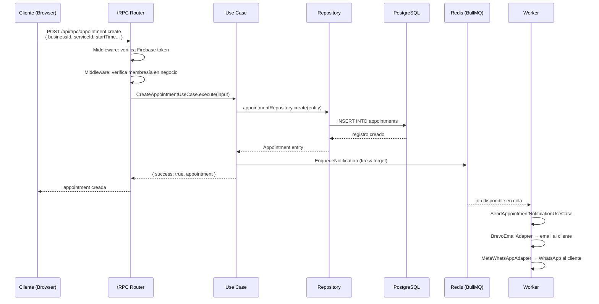
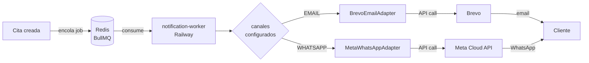

# TuAgenda

Plataforma de agendamiento de citas para negocios.

## Estructura del monorepo

```
apps/
  web-app/              # Next.js — frontend + API (tRPC)
  notification-worker/  # Worker BullMQ — procesa notificaciones (email, WhatsApp)
packages/
  db/                   # Prisma schema, migraciones, cliente
  notifications/        # Lógica de notificaciones (use cases, adaptadores)
```

## Arquitectura

El proyecto usa **arquitectura hexagonal** (ports & adapters). La regla central es que las capas internas no conocen a las externas: el dominio no sabe nada de Prisma, tRPC, Brevo ni Redis.

### Capas

```
┌─────────────────────────────────────────────────────────────────────┐
│  PRESENTACIÓN  (tRPC routers)                                        │
│  Entrada del mundo externo. Valida input, llama use cases,           │
│  convierte errores a TRPCError.                                      │
│                                                                      │
│   ┌─────────────────────────────────────────────────────────────┐   │
│   │  APLICACIÓN  (Use Cases)                                     │   │
│   │  Orquesta el flujo. Aplica reglas de negocio. Depende solo   │   │
│   │  de interfaces (ports), nunca de implementaciones concretas. │   │
│   │                                                              │   │
│   │   ┌───────────────────────────────────────────────────┐     │   │
│   │   │  DOMINIO  (Entities + Ports)                       │     │   │
│   │   │  Núcleo de la aplicación. Sin dependencias         │     │   │
│   │   │  externas. Define qué puede hacer el sistema.      │     │   │
│   │   │                                                    │     │   │
│   │   │  Entidades: User, Business, Appointment,           │     │   │
│   │   │  Service, BusinessUser, EmployeeAvailability...    │     │   │
│   │   │                                                    │     │   │
│   │   │  Ports: IUserRepository, IBusinessRepository,      │     │   │
│   │   │  IAppointmentRepository, IAuthorizationPort...     │     │   │
│   │   └───────────────────────────────────────────────────┘     │   │
│   └─────────────────────────────────────────────────────────────┘   │
│                                                                      │
│  INFRAESTRUCTURA  (Adapters)                                         │
│  Implementaciones concretas de los ports. El dominio define          │
│  la interfaz; la infraestructura la cumple.                          │
│                                                                      │
│  PrismaUserRepository    →  implementa IUserRepository               │
│  PrismaAppointmentRepo   →  implementa IAppointmentRepository        │
│  BullMQQueueAdapter      →  implementa INotificationQueuePort        │
│  BrevoEmailAdapter       →  implementa INotificationSenderPort       │
│  MetaWhatsAppAdapter     →  implementa INotificationSenderPort       │
└─────────────────────────────────────────────────────────────────────┘
```

### Procedimientos tRPC (control de acceso)

```
publicProcedure          Sin autenticación
                         Booking público, health check

privateProcedure         Firebase token requerido
    └─ isAuthenticated   userId inyectado en context
                         Perfil de usuario, mis citas

businessMemberProcedure  Firebase token + membresía en negocio
    └─ isAuthenticated   userId + businessId en context
    └─ requireBusiness   Verifica BusinessUser en base de datos
    Access              Panel admin, servicios, empleados, citas
```

### Flujo de una request (ejemplo: crear cita)



### Flujo de notificaciones (asíncrono)



> Si Redis falla al encolar, la cita **se crea igual** (fire & forget). Las notificaciones tienen 3 reintentos con backoff exponencial.

### Stack por capa

| Capa | Tecnología |
|------|------------|
| Presentación | tRPC v11, Next.js 15, Zod |
| Aplicación | TypeScript puro (sin frameworks) |
| Dominio | TypeScript puro (sin dependencias) |
| Infraestructura — DB | Prisma ORM + PostgreSQL (Railway) |
| Infraestructura — Auth | Firebase Admin SDK |
| Infraestructura — Queue | BullMQ + Redis (Railway) |
| Infraestructura — Email | Brevo REST API |
| Infraestructura — WhatsApp | Meta Cloud API |
| Frontend | Next.js, React, Tailwind CSS, shadcn/ui |
| Deploy | Vercel (web-app) + Railway (worker + DB + Redis) |

---

## Requisitos

- Node.js >= 20
- pnpm >= 10
- Docker (para la base de datos local)
- Redis (local o Railway)

## Setup inicial

```bash
# Instalar dependencias
pnpm install

# Levantar base de datos local (PostgreSQL via Docker)
pnpm db:start

# Correr migraciones
pnpm db:migrate

# Copiar variables de entorno
cp apps/web-app/.env.example apps/web-app/.env
cp apps/notification-worker/.env.example apps/notification-worker/.env
```

## Variables de entorno

### `apps/web-app/.env`

| Variable | Descripción |
|----------|-------------|
| `DATABASE_URL` | URL de conexión a PostgreSQL |
| `REDIS_URL` | URL de Redis (interno en Railway, público para local/Vercel) |

### `apps/notification-worker/.env`

| Variable | Descripción |
|----------|-------------|
| `REDIS_URL` | URL de Redis — debe apuntar al mismo Redis que la web app |
| `BREVO_API_KEY` | API key de Brevo para envío de emails |
| `EMAIL_FROM_NAME` | Nombre del remitente (ej: `TuAgenda`) |
| `EMAIL_FROM_ADDRESS` | Email del remitente (ej: `no-reply@tuagenda.pe`) |
| `META_ACCESS_TOKEN` | Token de Meta Cloud API para WhatsApp |
| `WHATSAPP_PHONE_NUMBER_ID` | ID del número de WhatsApp Business |

> Los template IDs de Brevo y Meta se configuran por negocio desde el panel de Settings → Notificaciones.

## Desarrollo local

### Levantar todo junto (recomendado)

```bash
pnpm dev:all
```

Usa Turborepo con `--ui=tui`: abre un panel interactivo donde podés navegar entre la web app y el notification worker con las flechas del teclado y ver sus logs por separado.

### Levantar por separado

```bash
# Solo la web app (Next.js en http://localhost:3000)
pnpm dev

# Solo el notification worker
pnpm --filter notification-worker dev

# Solo el package de notificaciones en modo watch (si modificás lógica de notificaciones)
pnpm --filter notifications dev
```

## Comandos útiles

```bash
# Base de datos
pnpm db:start           # Levantar PostgreSQL con Docker
pnpm db:stop            # Detener Docker
pnpm db:reset           # Bajar, levantar y re-migrar (borra todos los datos)
pnpm db:migrate         # Correr migraciones pendientes (deploy)
pnpm db:migrate:dev     # Crear nueva migración en desarrollo
pnpm db:migrate:status  # Ver estado de migraciones
pnpm db:push            # Push del schema sin crear migración (prototipado)
pnpm db:generate        # Regenerar Prisma Client
pnpm db:studio          # Abrir Prisma Studio
pnpm db:seed            # Poblar base de datos con datos de prueba

# Calidad de código
pnpm type-check        # Verificar tipos en todas las apps
pnpm lint              # Lint en todas las apps
pnpm lint:fix          # Lint + autofix
```

## Sistema de notificaciones

Las notificaciones se procesan de forma asíncrona:

1. Al crear una cita, la web app encola un job en **Redis** (BullMQ)
2. El **notification-worker** escucha la cola y procesa el job
3. Dependiendo de los canales configurados por el negocio, envía email (Brevo) o WhatsApp (Meta Cloud API)

### Configurar notificaciones para un negocio

Desde el panel de administración: **Settings → Notificaciones**

- Activar canales (email, WhatsApp)
- Ingresar los template IDs correspondientes de Brevo o Meta

## Producción

| Servicio | Plataforma |
|----------|------------|
| Web app | Vercel |
| Notification worker | Railway |
| Base de datos | Railway (PostgreSQL) |
| Redis | Railway |

> En Vercel usar `REDIS_PUBLIC_URL` de Railway (URL pública). En el worker de Railway usar `REDIS_URL` (URL interna).
