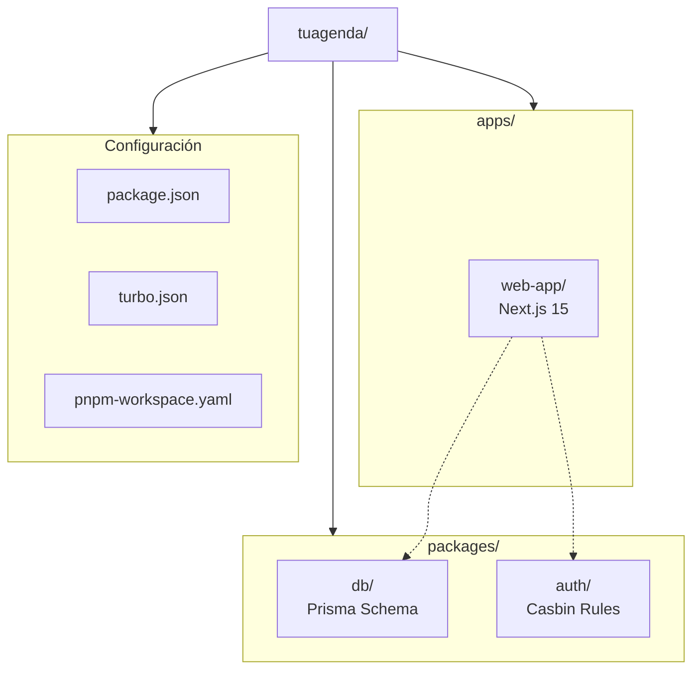
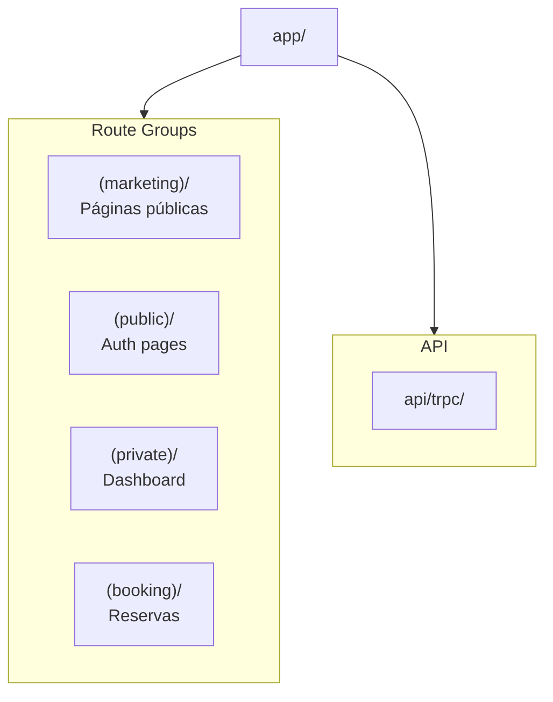
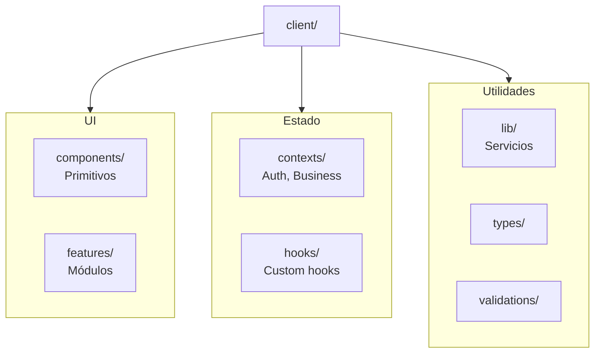
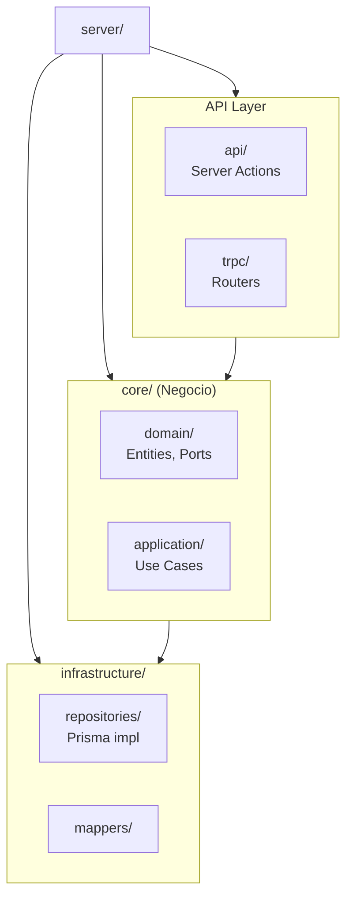

# Estructura de Carpetas

## Monorepo



## Web App (apps/web-app/)

```
apps/web-app/
├── src/
│   ├── app/                    # Next.js App Router
│   ├── client/                 # Código del cliente
│   ├── server/                 # Código del servidor
│   └── shared/                 # Código compartido
├── public/                     # Assets estáticos
├── next.config.ts
├── tailwind.config.ts
└── package.json
```

### App Router (src/app/)



```
src/app/
├── (marketing)/           # Landing, pricing, features
│   ├── page.tsx          # Home
│   ├── about-us/
│   ├── pricing/
│   └── features/
│
├── (public)/              # Autenticación
│   ├── login/
│   ├── signup/
│   └── forgot-password/
│
├── (private)/             # Requiere auth
│   ├── dashboard/
│   ├── calendar/
│   ├── appointments/
│   ├── clients/
│   ├── services/
│   ├── employees/
│   └── settings/
│
├── (booking)/             # Flujo de reservas público
│   └── [slug]/
│
├── api/
│   └── trpc/              # Endpoint tRPC
│
├── layout.tsx             # Root layout
└── globals.css
```

### Client (src/client/)



```
src/client/
├── components/
│   └── ui/               # Radix UI wrappers
│       ├── button.tsx
│       ├── input.tsx
│       ├── dialog.tsx
│       └── ...
│
├── features/             # Módulos por dominio
│   ├── appointments/
│   │   ├── components/
│   │   ├── hooks/
│   │   └── types.ts
│   ├── calendar/
│   ├── clients/
│   ├── services/
│   └── employees/
│
├── contexts/
│   ├── auth-context.tsx
│   └── business-context.tsx
│
├── hooks/
│   ├── use-auth.ts
│   ├── use-permission.ts
│   └── use-booking-flow.ts
│
├── lib/
│   ├── auth/             # Firebase client
│   ├── trpc/             # tRPC client
│   └── logger.ts
│
└── validations/          # Zod schemas (client)
```

### Server (src/server/)



```
src/server/
├── core/
│   ├── domain/
│   │   ├── entities/
│   │   │   ├── User.ts
│   │   │   ├── Business.ts
│   │   │   ├── Service.ts
│   │   │   └── Appointment.ts
│   │   └── repositories/
│   │       ├── IUserRepository.ts
│   │       ├── IBusinessRepository.ts
│   │       └── IAppointmentRepository.ts
│   │
│   └── application/
│       └── use-cases/
│           ├── user/
│           ├── business/
│           ├── service/
│           └── appointment/
│
├── infrastructure/
│   ├── repositories/
│   │   ├── PrismaUserRepository.ts
│   │   └── PrismaBusinessRepository.ts
│   └── mappers/
│       ├── UserMapper.ts
│       └── BusinessMapper.ts
│
├── api/
│   └── authorization/
│       └── check-permission.action.ts
│
└── trpc/
    ├── index.ts
    ├── trpc.ts           # Context & middleware
    ├── server.ts         # Server-side caller
    └── routers/
        ├── app.router.ts # Root router
        ├── user.router.ts
        ├── business.router.ts
        └── appointment.router.ts
```

### Shared (src/shared/)

```
src/shared/
├── types/                # Tipos compartidos
├── validations/          # Zod schemas compartidos
├── utils/                # Funciones utilitarias
├── constants/            # Constantes
└── lib/                  # Librerías compartidas
```

## Packages

### db (packages/db/)

```
packages/db/
├── prisma/
│   ├── schema.prisma     # Schema de la BD
│   └── migrations/       # Migraciones
├── src/
│   └── index.ts          # Export PrismaClient
└── package.json
```

### auth (packages/auth/)

```
packages/auth/
├── src/
│   ├── casbin/
│   │   ├── enforcer.ts   # Casbin enforcer
│   │   └── model.conf    # Casbin model
│   └── index.ts
└── package.json
```

## Convenciones de Nombres

| Tipo | Patrón | Ejemplo |
|------|--------|---------|
| Componentes React | PascalCase | `UserProfile.tsx` |
| Server Actions | kebab-case + `.action.ts` | `get-user.action.ts` |
| Hooks | camelCase + `use` prefix | `useAuth.ts` |
| Use Cases | PascalCase | `CreateUser.ts` |
| Repositories | PascalCase + `Repository` | `PrismaUserRepository.ts` |
| Interfaces | `I` prefix + PascalCase | `IUserRepository.ts` |
| Mappers | PascalCase + `Mapper` | `UserMapper.ts` |
| Schemas Zod | kebab-case + `.schema.ts` | `user.schema.ts` |
