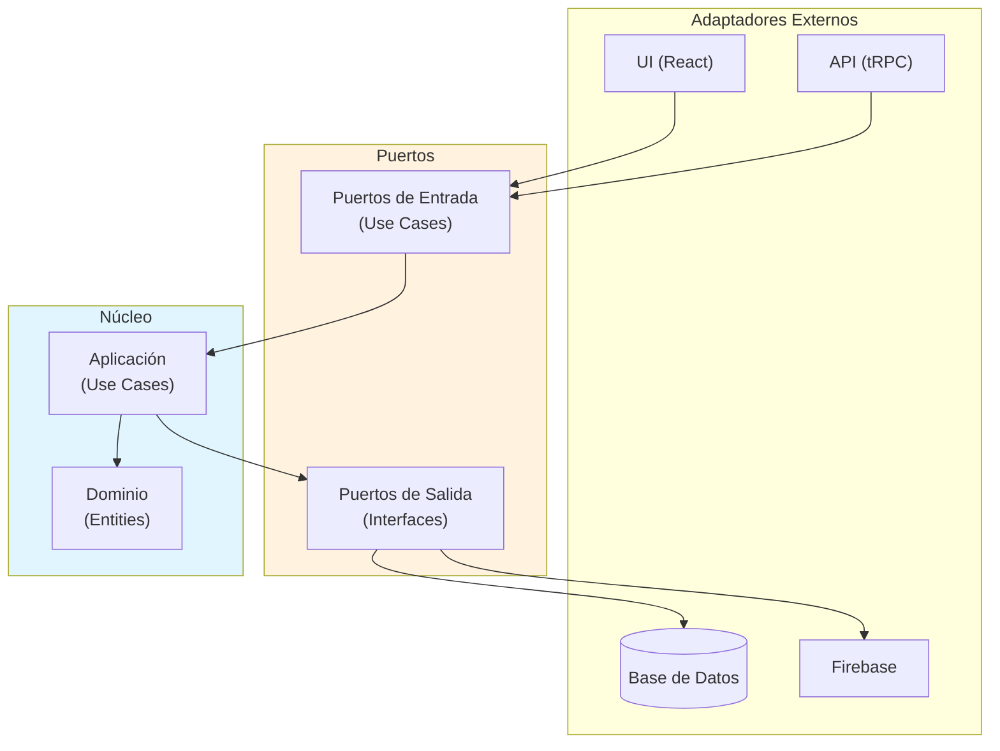
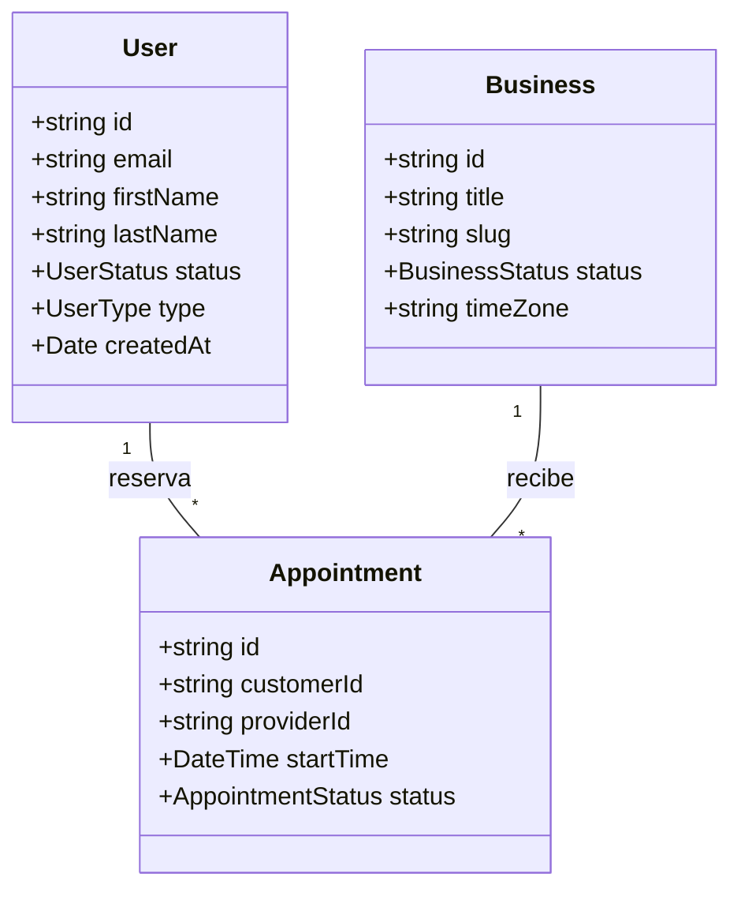
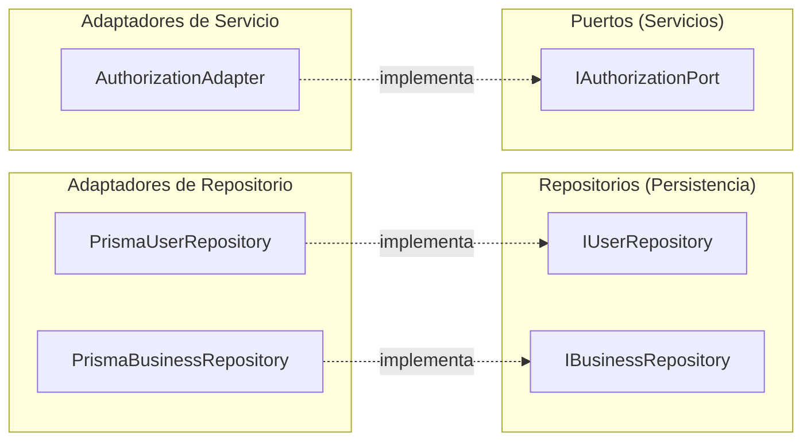
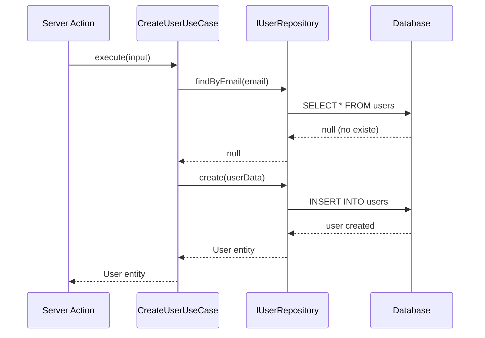
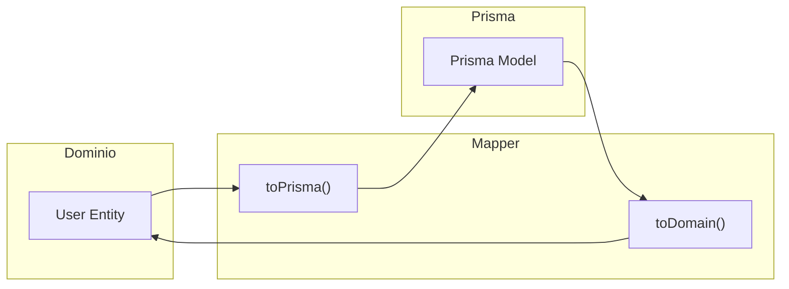
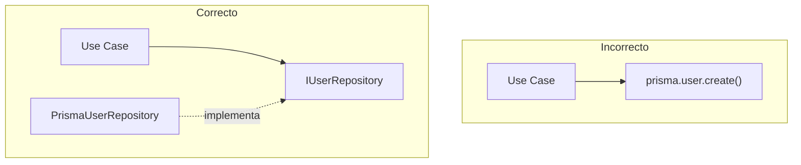

# Arquitectura Hexagonal

## Concepto

La arquitectura hexagonal (Ports & Adapters) aísla la lógica de negocio de los detalles técnicos.



## Estructura de Carpetas

```
src/server/
├── core/
│   ├── domain/
│   │   ├── entities/
│   │   │   ├── User.ts
│   │   │   ├── Business.ts
│   │   │   ├── Service.ts
│   │   │   └── Appointment.ts
│   │   ├── repositories/          # Puertos de persistencia
│   │   │   ├── IUserRepository.ts
│   │   │   ├── IBusinessRepository.ts
│   │   │   └── IAppointmentRepository.ts
│   │   └── ports/                 # Puertos de servicios externos
│   │       └── IAuthorizationPort.ts
│   │
│   └── application/
│       └── use-cases/
│           ├── user/
│           │   └── CreateUser.ts
│           └── business/
│               └── DeleteBusiness.ts
│
└── infrastructure/
    ├── repositories/              # Adaptadores de persistencia
    │   ├── PrismaUserRepository.ts
    │   └── PrismaBusinessRepository.ts
    └── adapters/                  # Adaptadores de servicios externos
        └── AuthorizationAdapter.ts
```

### Diferencia entre Repositories y Ports

| Carpeta | Propósito | Ejemplo |
|---------|-----------|---------|
| `repositories/` | Persistencia de entidades (CRUD) | `IBusinessRepository` |
| `ports/` | Servicios externos (no-persistencia) | `IAuthorizationPort` |

## Capas en Detalle

### 1. Dominio (Entities)

Las entidades representan conceptos de negocio puros, sin dependencias técnicas.

```typescript
// src/server/core/domain/entities/User.ts
export interface User {
  id: string;          // Firebase UID
  email: string;
  firstName: string;
  lastName: string;
  status: UserStatus;
  type: UserType;
  createdAt: Date;
  updatedAt: Date;
}

export type UserStatus = 'hidden' | 'visible' | 'disabled' | 'blocked';
export type UserType = 'customer' | 'admin' | 'superadmin';
```



### 2. Puertos (Interfaces)

Los puertos definen contratos que la infraestructura debe implementar. Hay dos tipos:

#### Repositorios (Persistencia)

```typescript
// src/server/core/domain/repositories/IUserRepository.ts
export interface IUserRepository {
  findById(id: string): Promise<User | null>;
  findByEmail(email: string): Promise<User | null>;
  create(user: CreateUserInput): Promise<User>;
  update(id: string, data: UpdateUserInput): Promise<User>;
  delete(id: string): Promise<void>;
}
```

#### Puertos de Servicios (No-persistencia)

```typescript
// src/server/core/domain/ports/IAuthorizationPort.ts
export interface IAuthorizationPort {
  canPerform(request: AuthorizationRequest): Promise<boolean>;
}
```



### 3. Aplicación (Use Cases)

Los casos de uso orquestan la lógica de negocio.

```typescript
// src/server/core/application/use-cases/user/CreateUser.ts
export class CreateUserUseCase {
  constructor(private userRepository: IUserRepository) {}

  async execute(input: CreateUserInput): Promise<User> {
    // 1. Validar que no exista
    const existing = await this.userRepository.findByEmail(input.email);
    if (existing) {
      throw new Error('User already exists');
    }

    // 2. Crear usuario
    return this.userRepository.create({
      ...input,
      status: 'hidden',
      type: 'customer',
    });
  }
}
```



### 4. Infraestructura (Adapters)

Los adaptadores implementan los puertos usando tecnologías específicas.

```typescript
// src/server/infrastructure/repositories/PrismaUserRepository.ts
export class PrismaUserRepository implements IUserRepository {
  constructor(private prisma: PrismaClient) {}

  async findById(id: string): Promise<User | null> {
    const user = await this.prisma.user.findUnique({
      where: { id },
    });
    return user ? UserMapper.toDomain(user) : null;
  }

  async create(input: CreateUserInput): Promise<User> {
    const user = await this.prisma.user.create({
      data: UserMapper.toPrisma(input),
    });
    return UserMapper.toDomain(user);
  }
}
```

## Mappers

Los mappers convierten entre modelos de dominio y modelos de Prisma.



```typescript
// src/server/infrastructure/mappers/UserMapper.ts
export class UserMapper {
  static toDomain(prismaUser: PrismaUser): User {
    return {
      id: prismaUser.id,
      email: prismaUser.email,
      firstName: prismaUser.firstName,
      lastName: prismaUser.lastName,
      status: prismaUser.status as UserStatus,
      type: prismaUser.type as UserType,
      createdAt: prismaUser.createdAt,
      updatedAt: prismaUser.updatedAt,
    };
  }

  static toPrisma(user: CreateUserInput): Prisma.UserCreateInput {
    return {
      id: user.id,
      email: user.email,
      firstName: user.firstName,
      lastName: user.lastName,
    };
  }
}
```

## Beneficios

| Beneficio | Descripción |
|-----------|-------------|
| **Testabilidad** | Mockear repositorios fácilmente |
| **Mantenibilidad** | Lógica centralizada en Use Cases |
| **Flexibilidad** | Cambiar Prisma por otro ORM sin afectar negocio |
| **Claridad** | Separación clara de responsabilidades |

## Anti-patrones a Evitar



- ❌ Usar Prisma directamente en Use Cases
- ❌ Exponer modelos de Prisma a la UI
- ❌ Lógica de negocio en controladores/actions
- ✅ Usar interfaces (ports) para abstraer infraestructura
- ✅ Mapear entre capas con Mappers
- ✅ Mantener Use Cases puros y testeables
