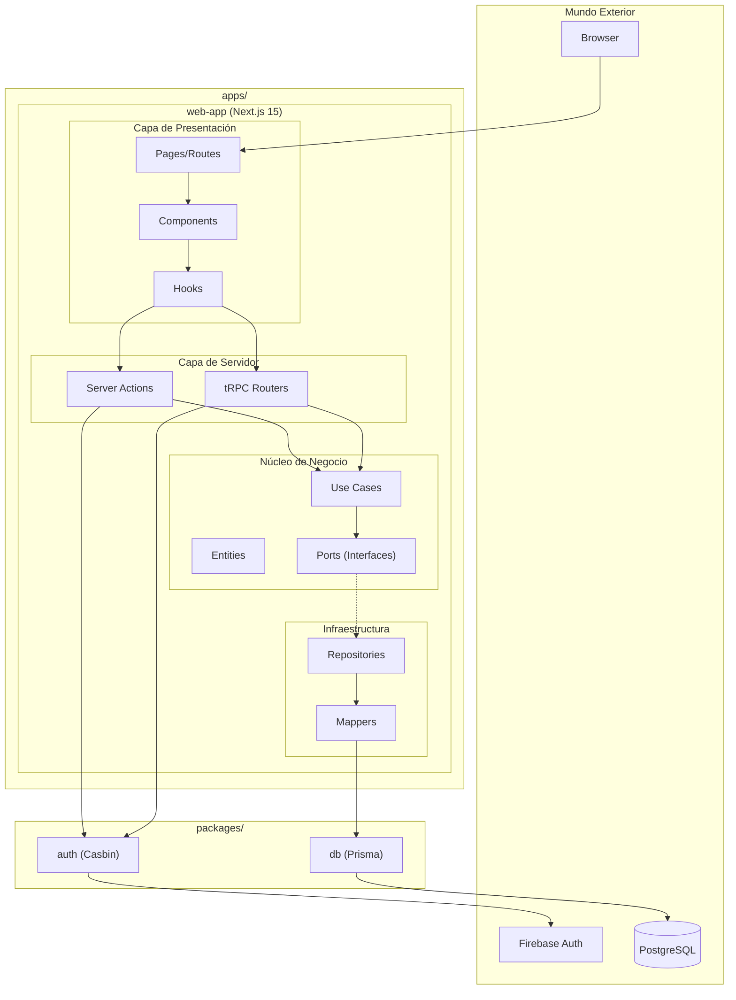
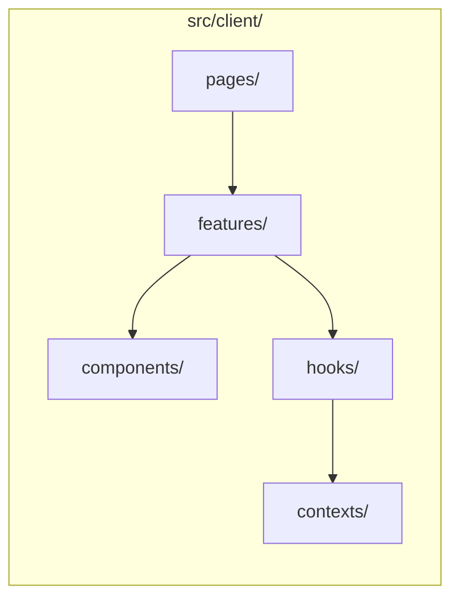
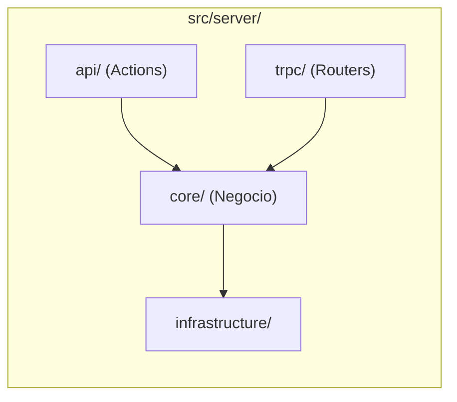
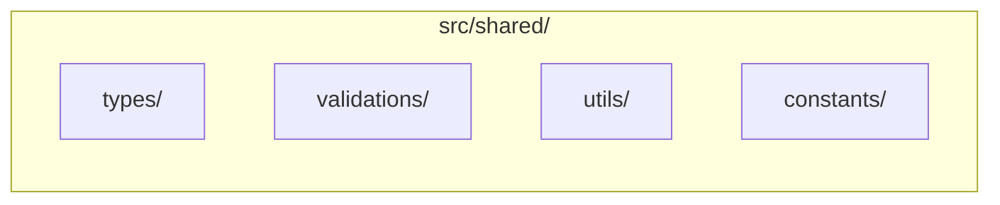
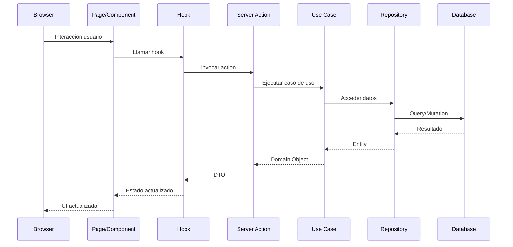
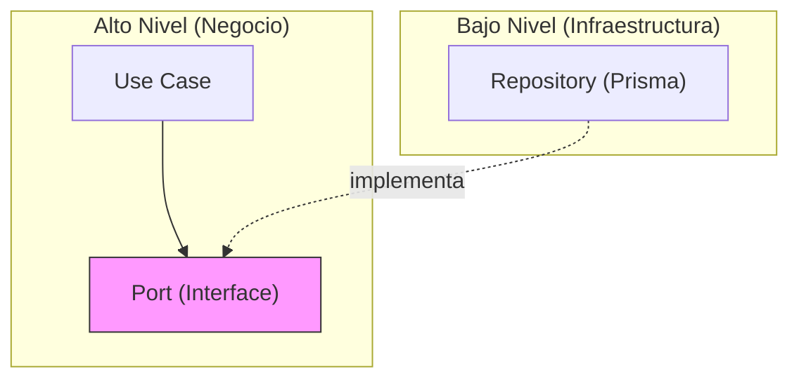

# Vista General

## Arquitectura del Sistema

TuAgenda sigue una arquitectura **Hexagonal (Ports & Adapters)** combinada con el patrón **Monorepo**.

## Capas del Sistema

### 1. Presentación (Client)

| Carpeta | Responsabilidad |
|---------|-----------------|
| `components/ui/` | Componentes primitivos (Radix UI) |
| `features/` | Módulos por dominio |
| `hooks/` | Custom React Hooks |
| `contexts/` | Estado global (Auth, Business) |

### 2. Servidor (Server)

| Carpeta | Responsabilidad |
|---------|-----------------|
| `api/` | Server Actions de Next.js |
| `trpc/` | Routers y procedures tRPC |
| `core/` | Lógica de negocio |
| `infrastructure/` | Adaptadores externos |

### 3. Shared

Código compartido entre cliente y servidor.

## Flujo de Datos

## Principios de Diseño

### Inversión de Dependencias

- Los **Use Cases** dependen de **Ports** (interfaces)
- Los **Repositories** implementan los **Ports**
- El negocio no conoce la infraestructura

### Separación de Concerns

| Capa | Conoce | No conoce |
|------|--------|-----------|
| UI | Hooks, Components | Use Cases, DB |
| Hooks | Actions, tRPC | Repositories |
| Use Cases | Ports | Prisma, PostgreSQL |
| Repositories | Prisma | UI, Hooks |
