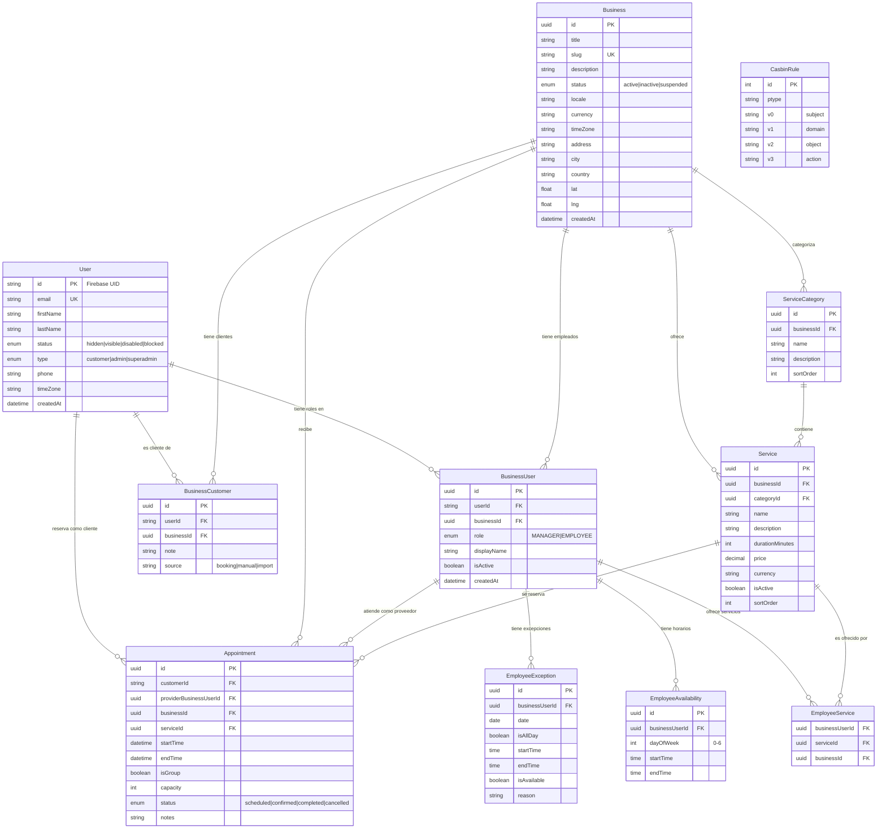
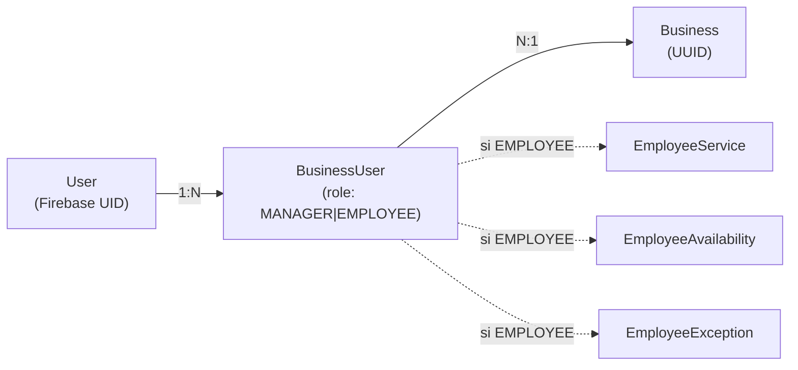
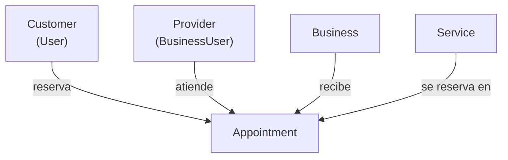
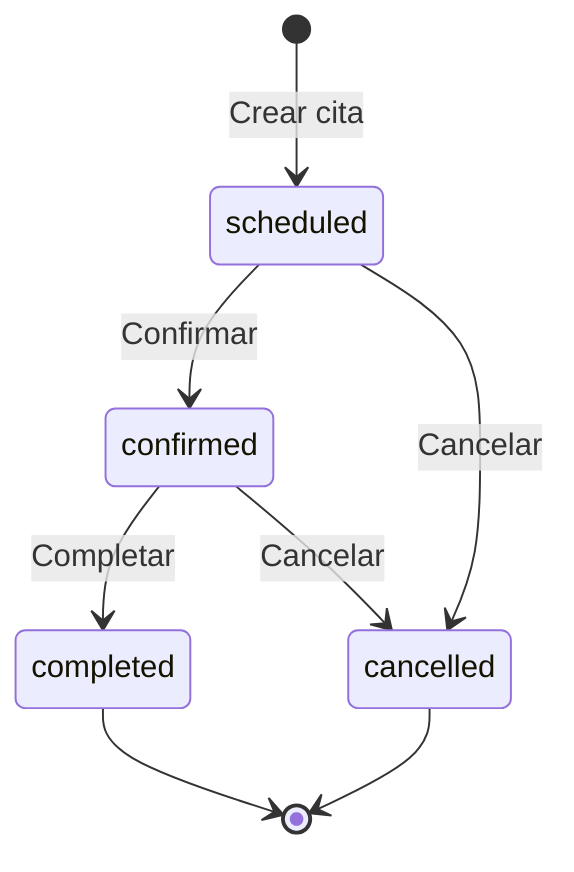

# Diagrama ERD

## Modelo Completo

## Relaciones Clave

### User - Business (N:M via BusinessUser)

### Flujo de Appointment

## Enums

### UserStatus

| Valor | Descripción |
|-------|-------------|
| `hidden` | Usuario oculto (recién creado) |
| `visible` | Usuario visible y activo |
| `disabled` | Usuario deshabilitado |
| `blocked` | Usuario bloqueado |

### BusinessStatus

| Valor | Descripción |
|-------|-------------|
| `active` | Negocio activo y visible |
| `inactive` | Negocio inactivo |
| `suspended` | Negocio suspendido |

### BusinessRole

| Valor | Descripción |
|-------|-------------|
| `MANAGER` | Administrador del negocio |
| `EMPLOYEE` | Empleado que ofrece servicios |

### AppointmentStatus

