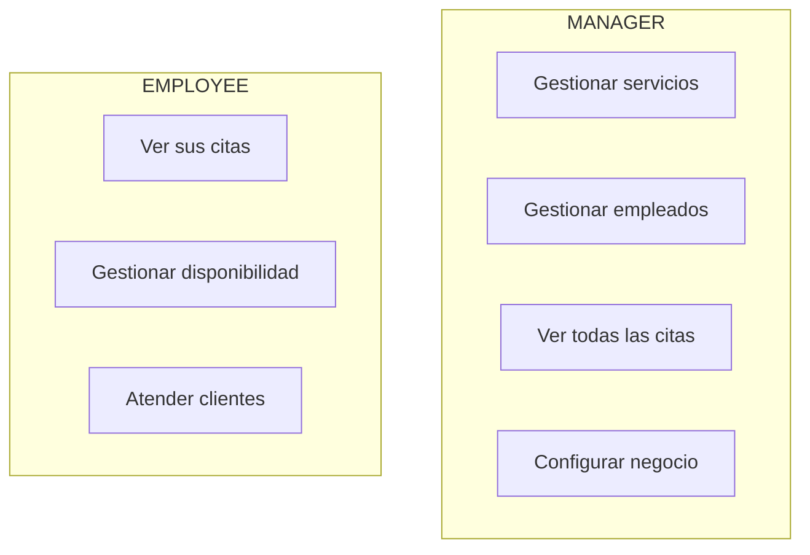
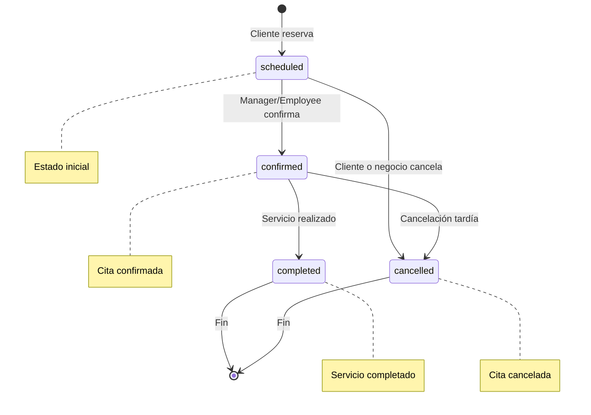

# Modelos

## User

Usuario del sistema. El ID es el Firebase UID.

```prisma
model User {
  id            String   @id // Firebase UID
  email         String   @unique
  firstName     String
  lastName      String
  status        UserStatus @default(hidden)
  type          UserType   @default(customer)
  birthday      DateTime?
  phone         String?
  countryCode   String?
  timeZone      String?
  pictureFullPath String?
  createdAt     DateTime @default(now())
  updatedAt     DateTime @updatedAt

  // Relaciones
  businessUsers         BusinessUser[]
  appointmentsAsCustomer Appointment[]
  businessCustomers     BusinessCustomer[]
}
```

### Notas Importantes

- El `id` es el UID de Firebase, **no** un UUID auto-generado
- Un User puede ser cliente (`type: customer`) o administrador del sistema
- Un User puede pertenecer a múltiples negocios con diferentes roles

---

## Business

Negocio/empresa que ofrece servicios.

```prisma
model Business {
  id          String   @id @default(uuid())
  title       String
  slug        String   @unique
  description String?
  logo        String?
  coverImage  String?
  status      BusinessStatus @default(active)

  // Localización
  locale      String   @default("es")
  currency    String   @default("USD")
  timeZone    String   @default("America/Lima")

  // Ubicación física
  address     String?
  city        String?
  state       String?
  country     String?
  postalCode  String?
  lat         Float?
  lng         Float?

  // Contacto
  email       String?
  phone       String?
  website     String?

  createdAt   DateTime @default(now())
  updatedAt   DateTime @updatedAt
}
```

### Slug

El `slug` es la URL amigable del negocio:
- `tuagenda.com/b/mi-salon` → slug = `mi-salon`

---

## BusinessUser

Relación N:M entre User y Business con rol.

```prisma
model BusinessUser {
  id          String   @id @default(uuid())
  userId      String
  businessId  String
  role        BusinessRole
  displayName String   // "Dr. Juan", "Lic. María"
  isActive    Boolean  @default(true)
  createdAt   DateTime @default(now())
  updatedAt   DateTime @updatedAt

  // Relaciones (solo si role = EMPLOYEE)
  employeeServices      EmployeeService[]
  employeeAvailability  EmployeeAvailability[]
  employeeExceptions    EmployeeException[]
  appointmentsAsProvider Appointment[]

  @@unique([userId, businessId])
}
```

### Roles y Permisos



---

## Service

Servicio que ofrece un negocio.

```prisma
model Service {
  id              String   @id @default(uuid())
  businessId      String
  categoryId      String?
  name            String
  description     String?
  durationMinutes Int
  price           Decimal
  currency        String
  isActive        Boolean  @default(true)
  sortOrder       Int      @default(0)
  createdAt       DateTime @default(now())
  updatedAt       DateTime @updatedAt
}
```

---

## EmployeeAvailability

Horarios semanales de un empleado.

```prisma
model EmployeeAvailability {
  id             String   @id @default(uuid())
  businessUserId String
  dayOfWeek      Int      // 0=Domingo, 1=Lunes, ..., 6=Sábado
  startTime      DateTime @db.Time
  endTime        DateTime @db.Time
  createdAt      DateTime @default(now())
  updatedAt      DateTime @updatedAt

  @@unique([businessUserId, dayOfWeek, startTime])
}
```

### Ejemplo de Horario

```mermaid
gantt
    title Horario Semanal - Dr. Juan
    dateFormat HH:mm
    axisFormat %H:%M

    section Lunes
    Mañana    :09:00, 13:00
    Tarde     :15:00, 19:00

    section Martes
    Mañana    :09:00, 13:00
    Tarde     :15:00, 19:00

    section Miércoles
    Mañana    :09:00, 13:00

    section Jueves
    Mañana    :09:00, 13:00
    Tarde     :15:00, 19:00

    section Viernes
    Mañana    :09:00, 13:00
```



---

## EmployeeException

Excepciones al horario regular (vacaciones, bloqueos, horarios especiales).

```prisma
model EmployeeException {
  id             String   @id @default(uuid())
  businessUserId String
  date           DateTime @db.Date
  isAllDay       Boolean  @default(false)
  startTime      DateTime? @db.Time
  endTime        DateTime? @db.Time
  isAvailable    Boolean  @default(false) // false=bloqueado, true=disponible
  reason         String?
  createdAt      DateTime @default(now())
  updatedAt      DateTime @updatedAt
}
```

### Tipos de Excepciones

| isAvailable | isAllDay | Significado |
|-------------|----------|-------------|
| `false` | `true` | Día libre completo |
| `false` | `false` | Bloqueo parcial (ej: cita médica) |
| `true` | `true` | Día extra de trabajo |
| `true` | `false` | Horario especial adicional |

---

## Appointment

Cita/reserva de un servicio.

```prisma
model Appointment {
  id                     String   @id @default(uuid())
  customerId             String?
  providerBusinessUserId String?
  businessId             String
  serviceId              String
  startTime              DateTime
  endTime                DateTime
  isGroup                Boolean  @default(false)
  capacity               Int?
  status                 AppointmentStatus @default(scheduled)
  notes                  String?
  createdAt              DateTime @default(now())
  updatedAt              DateTime @updatedAt
}
```

### Flujo de Estados


