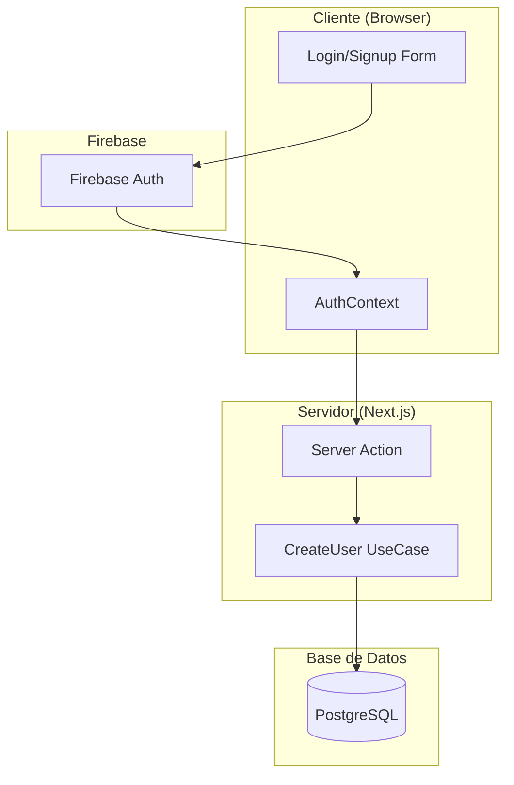
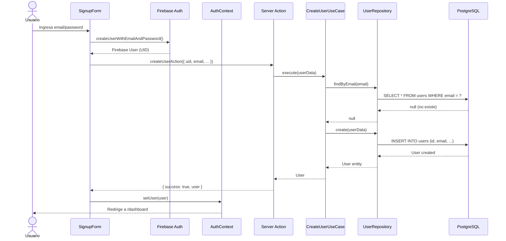
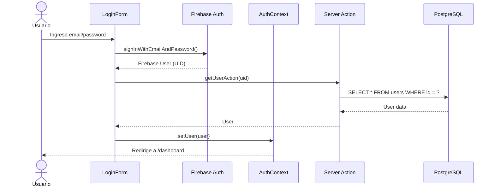
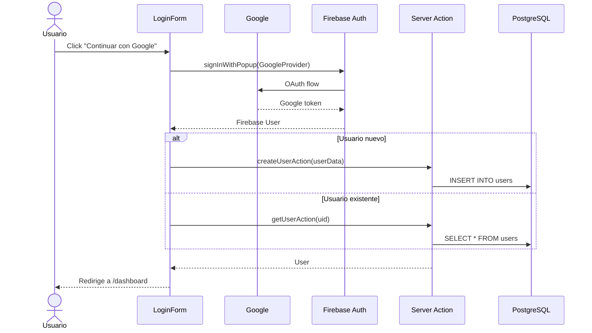
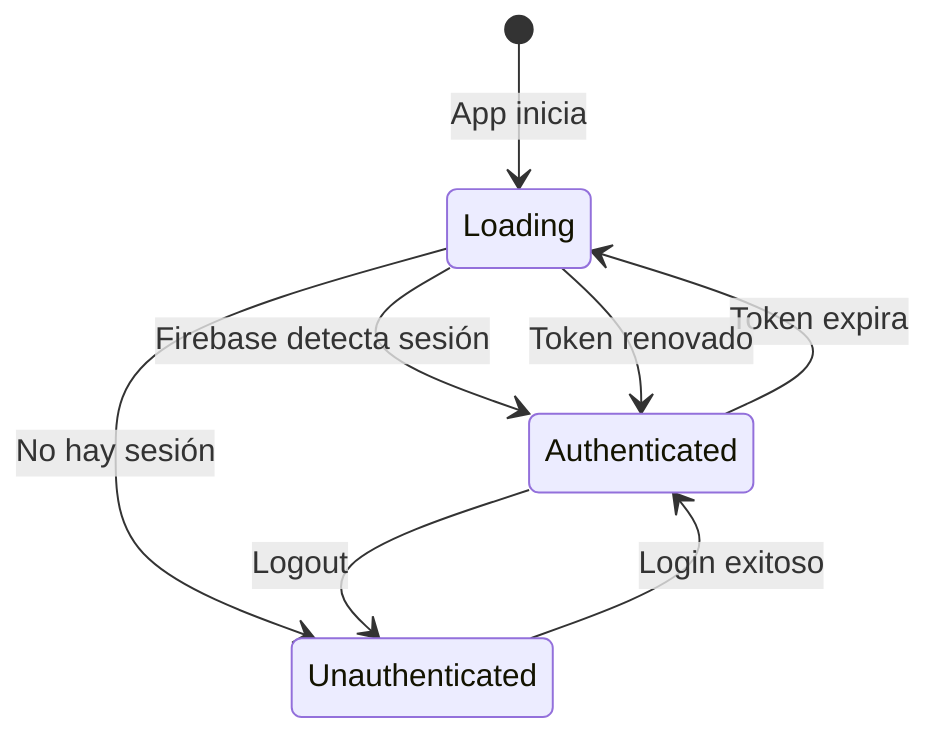
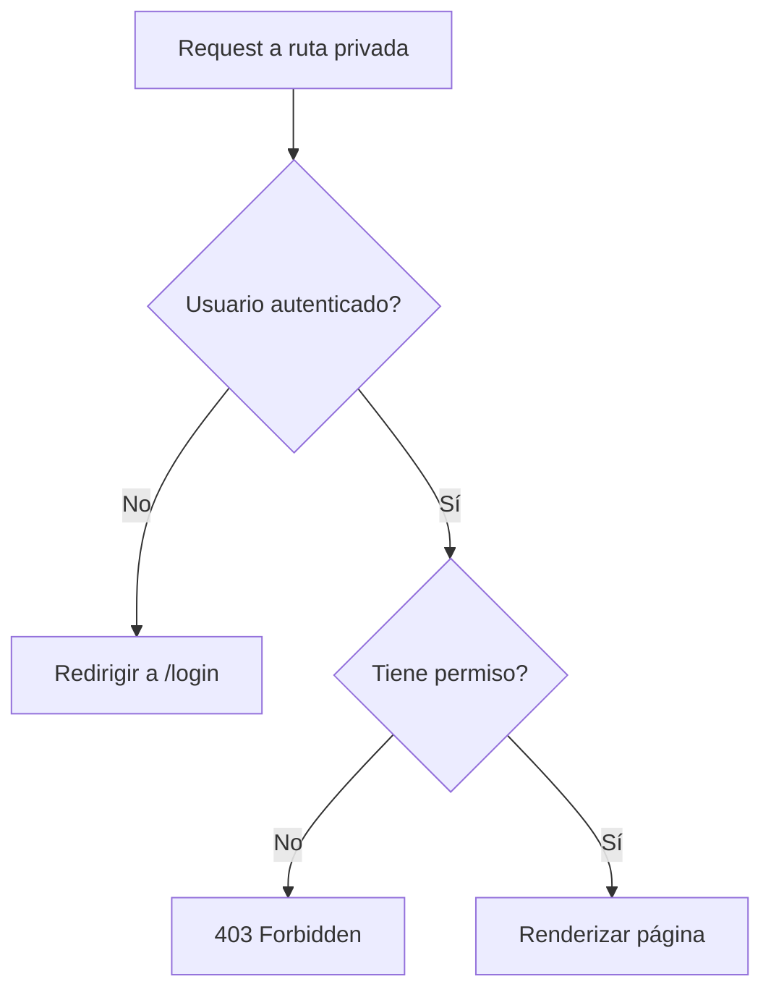
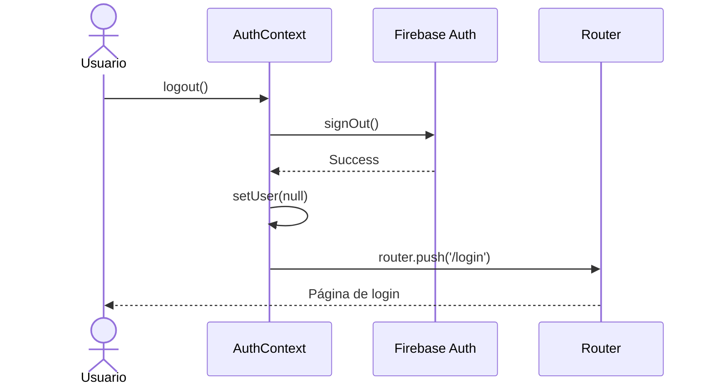

# Flujo de Autenticación

## Visión General

TuAgenda usa **Firebase Authentication** para autenticación y **PostgreSQL** para almacenar datos del usuario.



## Registro de Usuario



### Código de Registro

```typescript
// client/features/auth/components/signup-form.tsx
const handleSignup = async (data: SignupFormData) => {
  try {
    // 1. Crear usuario en Firebase
    const userCredential = await createUserWithEmailAndPassword(
      auth,
      data.email,
      data.password
    );

    // 2. Crear usuario en PostgreSQL
    await createUserAction({
      id: userCredential.user.uid,
      email: data.email,
      firstName: data.firstName,
      lastName: data.lastName,
    });

    // 3. Redirigir
    router.push('/dashboard');
  } catch (error) {
    // Handle error
  }
};
```

## Inicio de Sesión



## OAuth (Google)



## AuthContext

El contexto de autenticación mantiene el estado global del usuario.



```typescript
// client/contexts/auth-context.tsx
export function AuthProvider({ children }) {
  const [user, setUser] = useState<User | null>(null);
  const [loading, setLoading] = useState(true);

  useEffect(() => {
    // Escuchar cambios de autenticación
    const unsubscribe = onAuthStateChanged(auth, async (firebaseUser) => {
      if (firebaseUser) {
        // Obtener datos completos del usuario
        const userData = await getUserAction(firebaseUser.uid);
        setUser(userData);
      } else {
        setUser(null);
      }
      setLoading(false);
    });

    return () => unsubscribe();
  }, []);

  return (
    <AuthContext.Provider value={{ user, loading }}>
      {children}
    </AuthContext.Provider>
  );
}
```

## Protección de Rutas



### Middleware de Autenticación

```typescript
// middleware.ts
export async function middleware(request: NextRequest) {
  const session = await getSession(request);

  if (!session && request.nextUrl.pathname.startsWith('/(private)')) {
    return NextResponse.redirect(new URL('/login', request.url));
  }

  return NextResponse.next();
}
```

## Logout



## Manejo de Errores

| Error | Causa | Solución |
|-------|-------|----------|
| `auth/email-already-in-use` | Email ya registrado | Mostrar mensaje, sugerir login |
| `auth/weak-password` | Contraseña débil | Mostrar requisitos |
| `auth/user-not-found` | Usuario no existe | Sugerir registro |
| `auth/wrong-password` | Contraseña incorrecta | Mostrar error, ofrecer reset |
| `auth/too-many-requests` | Rate limit | Esperar, mostrar contador |
