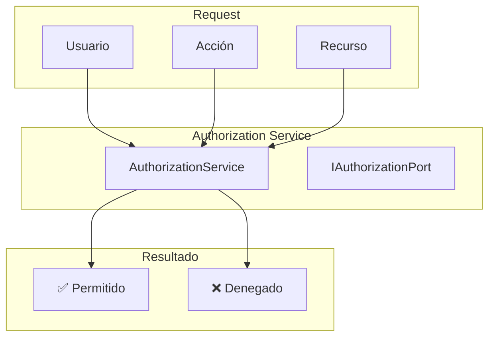
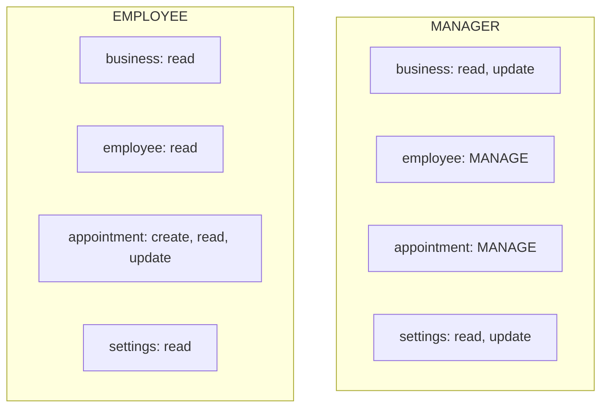
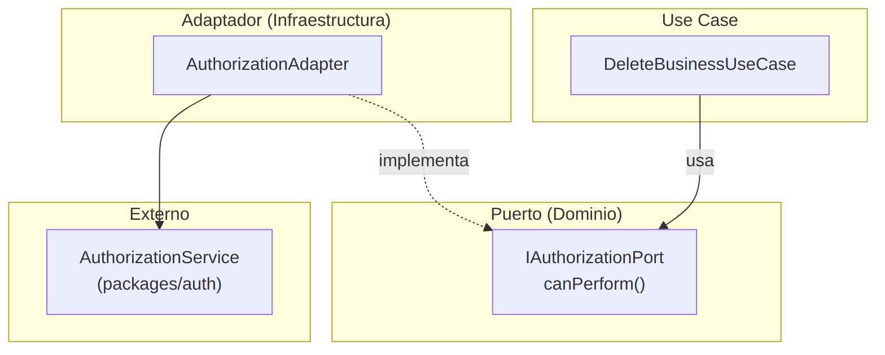

# Sistema de Autorización

## Visión General

TuAgenda implementa control de acceso basado en roles (RBAC) con soporte multi-tenant.

> **Nota**: La implementación de Casbin ha sido removida. El sistema actual es un stub que retorna `true` para todas las verificaciones de permisos. Necesitas implementar tu propia lógica de autorización.



## Modelo de Datos

### Tipos y Enums

```typescript
// packages/auth/src/types.ts

enum Resource {
  BUSINESS = "business",
  EMPLOYEE = "employee",
  APPOINTMENT = "appointment",
  SETTINGS = "settings",
}

enum Action {
  CREATE = "create",
  READ = "read",
  UPDATE = "update",
  DELETE = "delete",
  MANAGE = "manage",  // Wildcard: otorga todos los permisos CRUD
}

enum Role {
  MANAGER = "MANAGER",
  EMPLOYEE = "EMPLOYEE",
}

enum UserType {
  SUPERADMIN = "superadmin",
  ADMIN = "admin",
  CUSTOMER = "customer",
}
```

### Componentes

| Componente | Descripción | Ejemplo |
|------------|-------------|---------|
| `userId` | Usuario | `user_123` |
| `businessId` | Negocio/Tenant | `business_456` |
| `resource` | Recurso | `business`, `employee`, `appointment`, `settings` |
| `action` | Acción | `create`, `read`, `update`, `delete`, `manage` |

## Almacenamiento de Roles

Los roles se almacenan en la base de datos en las siguientes tablas:

### BusinessUser (Roles por negocio)

```typescript
// Un usuario puede tener diferentes roles en diferentes negocios
model BusinessUser {
  userId      String       // ID del usuario
  businessId  String       // ID del negocio
  role        BusinessRole // MANAGER o EMPLOYEE
}
```

### User (Tipo de usuario)

```typescript
// El tipo de usuario es global (no por negocio)
model User {
  id    String   // Firebase UID
  type  UserType // customer, admin, superadmin
}
```

## Permisos por Rol



### Matriz de Permisos Sugerida

| Recurso | Acción | MANAGER | EMPLOYEE |
|---------|--------|---------|----------|
| business | read | ✅ | ✅ |
| business | update | ✅ | ❌ |
| employee | create | ✅ | ❌ |
| employee | read | ✅ | ✅ |
| employee | update | ✅ | ❌ |
| employee | delete | ✅ | ❌ |
| appointment | create | ✅ | ✅ |
| appointment | read | ✅ | ✅ |
| appointment | update | ✅ | ✅ |
| appointment | delete | ✅ | ❌ |
| settings | read | ✅ | ✅ |
| settings | update | ✅ | ❌ |

> **Nota**: MANAGER podría tener `MANAGE` en employee y appointment, lo que equivale a todos los permisos CRUD.

## Arquitectura Hexagonal

La autorización sigue arquitectura hexagonal con puertos y adaptadores:



### Puerto de Autorización

```typescript
// src/server/core/domain/ports/IAuthorizationPort.ts

export interface AuthorizationRequest {
  userId: string;
  businessId: string;
  resource: Resource;
  action: Action;
}

export interface IAuthorizationPort {
  canPerform(request: AuthorizationRequest): Promise<boolean>;
}
```

### Adaptador de Autorización

```typescript
// src/server/infrastructure/adapters/AuthorizationAdapter.ts

export class AuthorizationAdapter implements IAuthorizationPort {
  async canPerform(request: AuthorizationRequest): Promise<boolean> {
    return canUserPerform(
      request.userId,
      request.businessId,
      request.resource,
      request.action
    );
  }
}
```

### Uso en Use Cases

```typescript
// src/server/core/application/use-cases/business/DeleteBusinessUseCase.ts

export class DeleteBusinessUseCase {
  constructor(
    private readonly authPort: IAuthorizationPort,
    private readonly businessRepo: IBusinessRepository
  ) {}

  async execute(userId: string, businessId: string) {
    // 1. Verificar autorización
    const allowed = await this.authPort.canPerform({
      userId,
      businessId,
      resource: Resource.BUSINESS,
      action: Action.DELETE,
    });

    if (!allowed) {
      return { success: false, error: "Forbidden" };
    }

    // 2. Ejecutar lógica de negocio
    await this.businessRepo.delete(businessId);
    return { success: true };
  }
}
```

## Implementación Cliente

### Server Action

```typescript
// src/server/api/authorization/check-permission.action.ts
'use server';

import { getAuthorizationService } from "@/server/lib/auth/authorization";
import { Resource, Action } from "auth";

export async function checkPermission(input: {
  businessId: string;
  resource: Resource;
  action: Action;
}): Promise<{ allowed: boolean; error?: string }> {
  const authService = getAuthorizationService();
  const currentUser = await getCurrentUser();

  const allowed = await authService.can({
    userId: currentUser.uid,
    businessId: input.businessId,
    resource: input.resource,
    action: input.action,
  });

  return { allowed };
}
```

### Hook del Cliente

```typescript
// src/client/hooks/usePermission.ts

export function usePermission(options: {
  businessId: string;
  resource: Resource;
  action: Action;
}): { allowed: boolean; loading: boolean } {
  const [allowed, setAllowed] = useState(false);
  const [loading, setLoading] = useState(true);

  useEffect(() => {
    checkPermission(options)
      .then((result) => setAllowed(result.allowed))
      .finally(() => setLoading(false));
  }, [options]);

  return { allowed, loading };
}
```

### Uso en Componentes

```tsx
// Mostrar/ocultar según permiso
function ServiceActions({ serviceId }: { serviceId: string }) {
  const canEdit = usePermission('service', 'update');
  const canDelete = usePermission('service', 'delete');

  return (
    <div>
      {canEdit && <EditButton serviceId={serviceId} />}
      {canDelete && <DeleteButton serviceId={serviceId} />}
    </div>
  );
}

// Proteger ruta completa
function SettingsPage() {
  const canAccessSettings = usePermission('settings', 'read');

  if (!canAccessSettings) {
    return <AccessDenied />;
  }

  return <SettingsContent />;
}
```

## Implementando Tu Propia Lógica de Autorización

El `AuthorizationService` actual es un stub. Para implementar tu lógica:

### Opción 1: Lógica Simple Basada en Roles

```typescript
// packages/auth/src/authorization-service.ts

async can(request: AuthorizationRequest): Promise<boolean> {
  // 1. Obtener el rol del usuario en el negocio
  const businessUser = await this.prisma.businessUser.findUnique({
    where: {
      userId_businessId: {
        userId: request.userId,
        businessId: request.businessId,
      }
    }
  });

  if (!businessUser) return false;

  // 2. Verificar permisos según el rol
  const { role } = businessUser;
  const { resource, action } = request;

  // MANAGER tiene acceso completo
  if (role === 'MANAGER') {
    return true;
  }

  // EMPLOYEE tiene acceso limitado
  if (role === 'EMPLOYEE') {
    // Solo lectura en business y employee
    if (resource === 'business' && action === 'read') return true;
    if (resource === 'employee' && action === 'read') return true;

    // CRUD en appointments (excepto delete)
    if (resource === 'appointment') {
      return ['create', 'read', 'update'].includes(action);
    }

    // Solo lectura en settings
    if (resource === 'settings' && action === 'read') return true;
  }

  return false;
}
```

### Opción 2: Sistema de Permisos con Base de Datos

Crear tablas para almacenar permisos:

```prisma
model Permission {
  id       String @id @default(uuid())
  role     String
  resource String
  action   String

  @@unique([role, resource, action])
}
```

### Opción 3: Usar otra librería

Alternativas a Casbin:
- **CASL**: Sistema de autorización más ligero
- **accesscontrol**: RBAC simple
- **permit.io**: Servicio externo de autorización

## Best Practices

1. **Verificar en servidor**: Siempre verificar permisos en el servidor, no solo en UI
2. **Principio de menor privilegio**: Asignar solo permisos necesarios
3. **Audit log**: Registrar cambios de permisos
4. **Testing**: Probar todos los escenarios de autorización
5. **Documentar**: Mantener documentada la matriz de permisos
