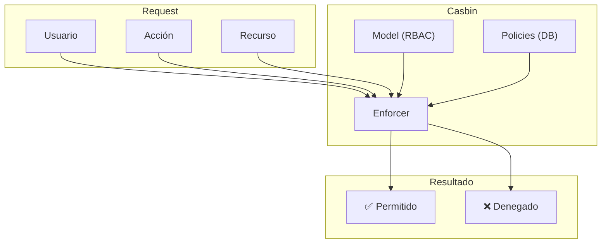
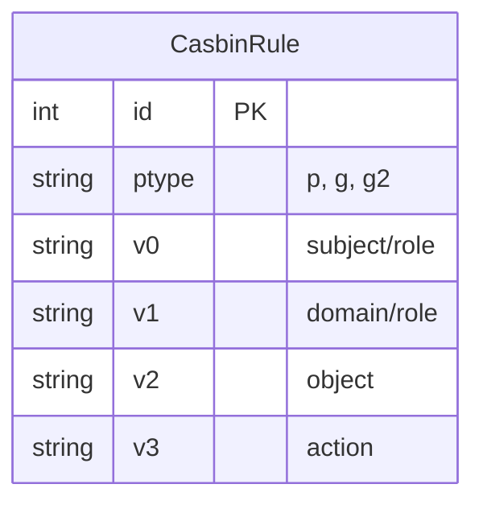
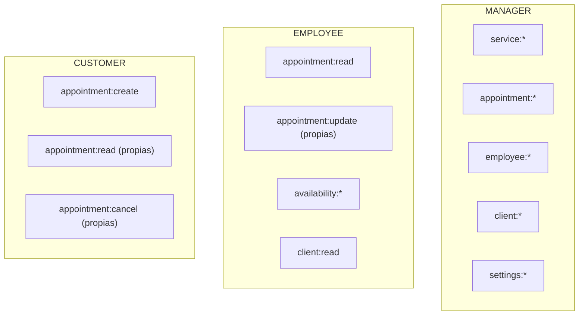
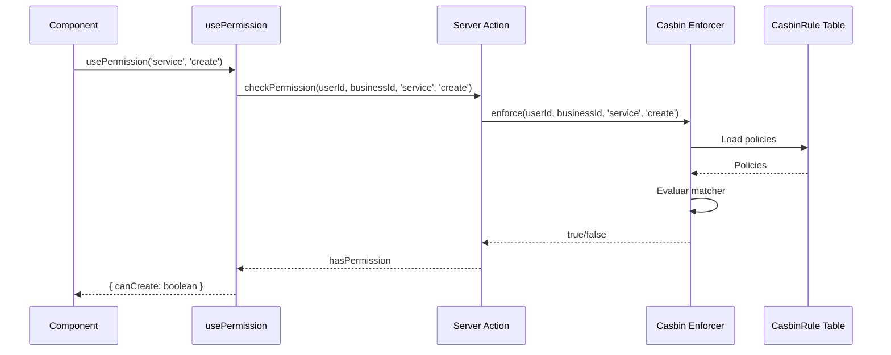
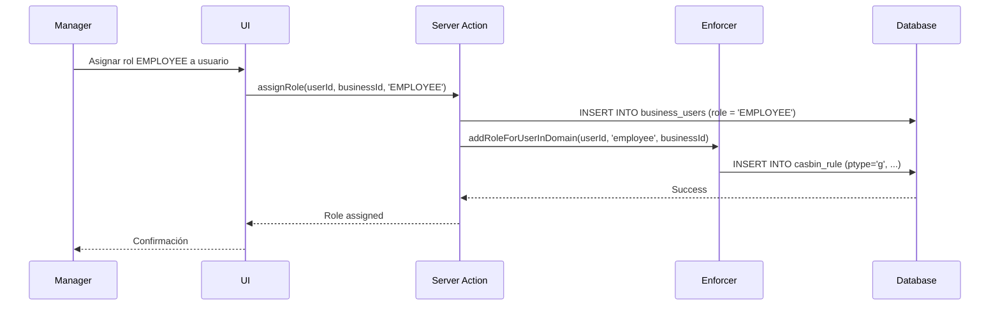

# Autorización con Casbin

## Visión General

TuAgenda usa **Casbin** para control de acceso basado en roles (RBAC) y atributos (ABAC).



## Modelo RBAC

```
# packages/auth/src/casbin/model.conf
[request_definition]
r = sub, dom, obj, act

[policy_definition]
p = sub, dom, obj, act

[role_definition]
g = _, _, _

[policy_effect]
e = some(where (p.eft == allow))

[matchers]
m = g(r.sub, p.sub, r.dom) && r.dom == p.dom && r.obj == p.obj && r.act == p.act
```

### Componentes

| Componente | Descripción | Ejemplo |
|------------|-------------|---------|
| `sub` (subject) | Usuario | `user_123` |
| `dom` (domain) | Negocio/Tenant | `business_456` |
| `obj` (object) | Recurso | `service`, `appointment` |
| `act` (action) | Acción | `create`, `read`, `update`, `delete` |

## Políticas

Las políticas se almacenan en la tabla `CasbinRule`:



### Tipos de Reglas

```sql
-- Política directa: usuario tiene permiso
INSERT INTO casbin_rule (ptype, v0, v1, v2, v3)
VALUES ('p', 'manager', 'business_123', 'service', 'create');

-- Agrupación: usuario tiene rol en dominio
INSERT INTO casbin_rule (ptype, v0, v1, v2)
VALUES ('g', 'user_456', 'manager', 'business_123');
```

### Permisos por Rol



## Flujo de Verificación



## Implementación

### Server Action

```typescript
// src/server/api/authorization/check-permission.action.ts
'use server';

import { getEnforcer } from '@tuagenda/auth';

export async function checkPermission(
  userId: string,
  businessId: string,
  object: string,
  action: string
): Promise<boolean> {
  const enforcer = await getEnforcer();

  // Verificar permiso directo o por rol
  return enforcer.enforce(userId, businessId, object, action);
}
```

### Hook del Cliente

```typescript
// src/client/hooks/usePermission.ts
import { useQuery } from '@tanstack/react-query';
import { checkPermission } from '@/server/api/authorization/check-permission.action';
import { useAuth } from './use-auth';
import { useBusiness } from './use-business';

export function usePermission(object: string, action: string) {
  const { user } = useAuth();
  const { currentBusiness } = useBusiness();

  const { data: hasPermission = false } = useQuery({
    queryKey: ['permission', user?.id, currentBusiness?.id, object, action],
    queryFn: () => checkPermission(
      user!.id,
      currentBusiness!.id,
      object,
      action
    ),
    enabled: !!user && !!currentBusiness,
  });

  return hasPermission;
}

// Versión con múltiples permisos
export function usePermissions(permissions: Array<{ object: string; action: string }>) {
  const { user } = useAuth();
  const { currentBusiness } = useBusiness();

  const results = useQueries({
    queries: permissions.map((p) => ({
      queryKey: ['permission', user?.id, currentBusiness?.id, p.object, p.action],
      queryFn: () => checkPermission(user!.id, currentBusiness!.id, p.object, p.action),
      enabled: !!user && !!currentBusiness,
    })),
  });

  return {
    canCreateService: results[0]?.data ?? false,
    canUpdateService: results[1]?.data ?? false,
    // ...
  };
}
```

### Uso en Componentes

```tsx
// Mostrar/ocultar según permiso
function ServiceActions({ serviceId }: { serviceId: string }) {
  const canEdit = usePermission('service', 'update');
  const canDelete = usePermission('service', 'delete');

  return (
    <div>
      {canEdit && <EditButton serviceId={serviceId} />}
      {canDelete && <DeleteButton serviceId={serviceId} />}
    </div>
  );
}

// Proteger ruta completa
function SettingsPage() {
  const canAccessSettings = usePermission('settings', 'read');

  if (!canAccessSettings) {
    return <AccessDenied />;
  }

  return <SettingsContent />;
}
```

## Asignación de Roles



### Código de Asignación

```typescript
// Al crear BusinessUser, asignar rol en Casbin
async function assignBusinessRole(
  userId: string,
  businessId: string,
  role: BusinessRole
) {
  const enforcer = await getEnforcer();

  // Agregar usuario al rol en el dominio
  await enforcer.addRoleForUserInDomain(
    userId,
    role.toLowerCase(), // 'manager' o 'employee'
    businessId
  );

  // Guardar políticas
  await enforcer.savePolicy();
}
```

## Matriz de Permisos

| Recurso | Acción | MANAGER | EMPLOYEE | CUSTOMER |
|---------|--------|---------|----------|----------|
| service | create | ✅ | ❌ | ❌ |
| service | read | ✅ | ✅ | ✅ |
| service | update | ✅ | ❌ | ❌ |
| service | delete | ✅ | ❌ | ❌ |
| appointment | create | ✅ | ✅ | ✅ |
| appointment | read | ✅ (todas) | ✅ (propias) | ✅ (propias) |
| appointment | update | ✅ | ✅ (propias) | ❌ |
| appointment | delete | ✅ | ❌ | ❌ |
| employee | create | ✅ | ❌ | ❌ |
| employee | read | ✅ | ✅ | ❌ |
| settings | * | ✅ | ❌ | ❌ |

## Best Practices

1. **Verificar en servidor**: Siempre verificar permisos en el servidor, no solo en UI
2. **Cache de políticas**: Casbin cachea políticas, refrescar al cambiar roles
3. **Audit log**: Registrar cambios de permisos
4. **Principio de menor privilegio**: Asignar solo permisos necesarios
