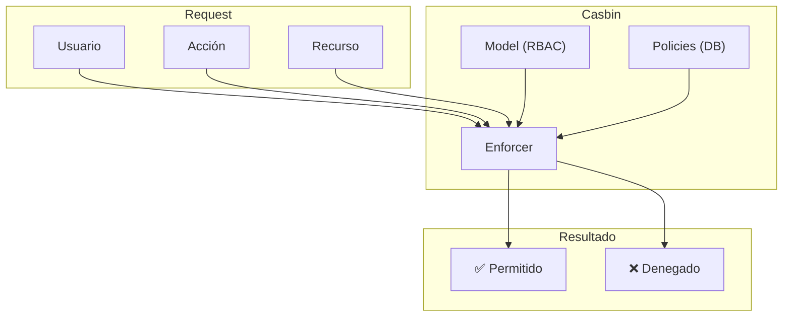
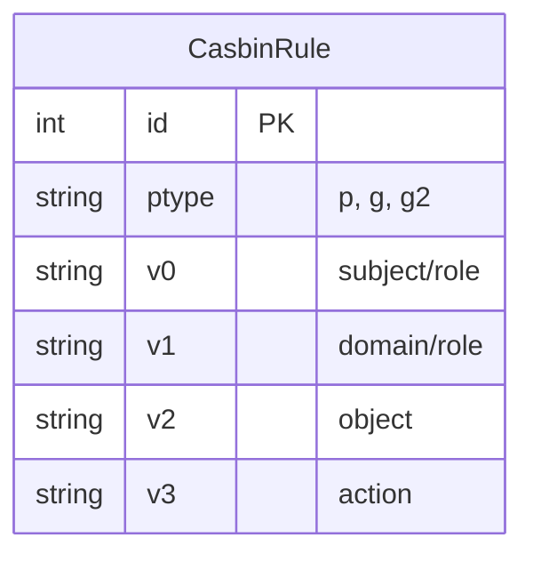
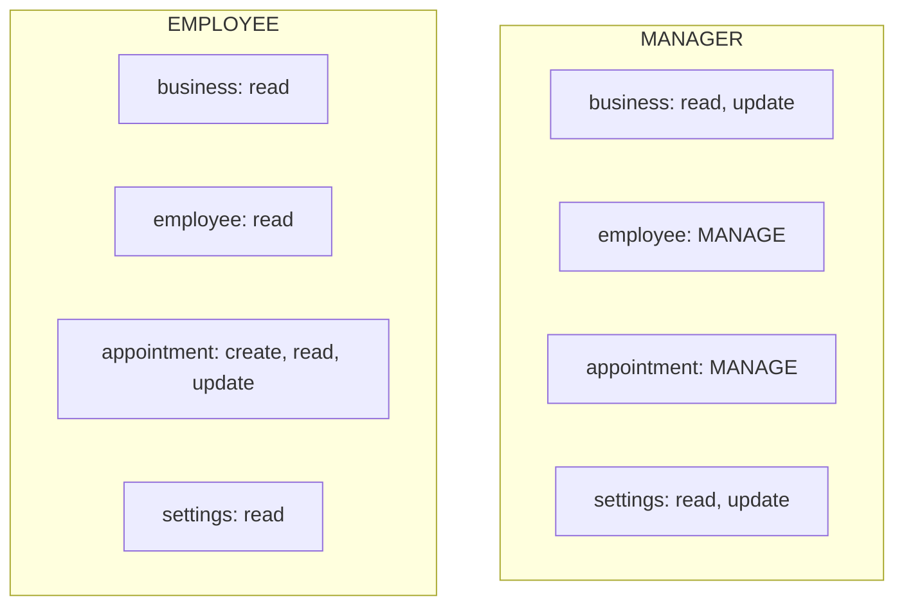
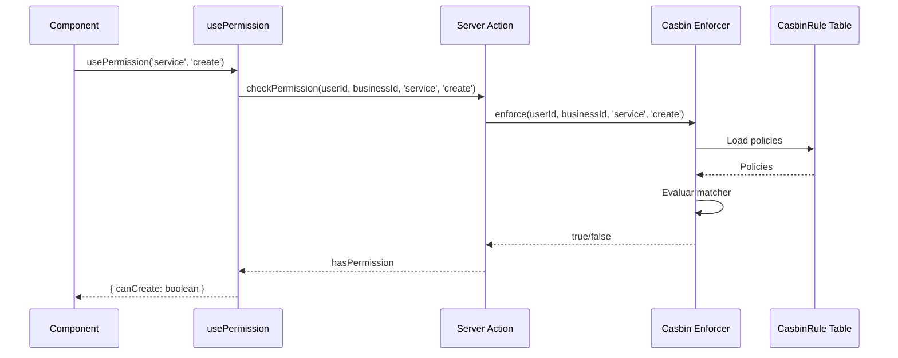
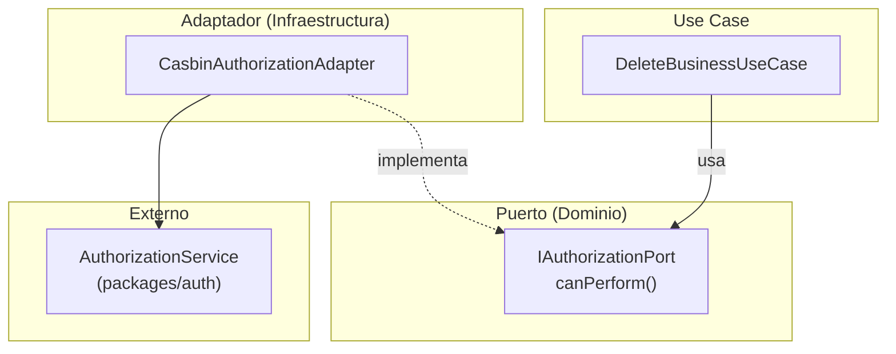
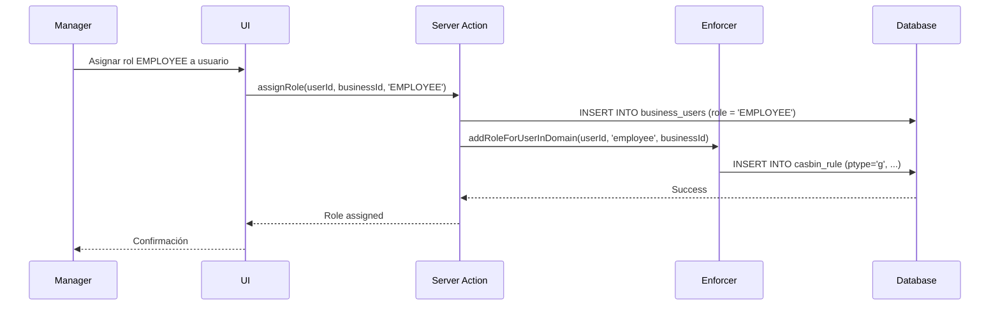

# Autorización con Casbin

## Visión General

TuAgenda usa **Casbin** para control de acceso basado en roles (RBAC) con soporte multi-tenant.



## Modelo RBAC

```
# packages/auth/src/casbin/model.conf
[request_definition]
r = sub, dom, obj, act

[policy_definition]
p = sub, dom, obj, act

[role_definition]
g = _, _, _    # role inheritance: user, role, domain
g2 = _, _      # user type inheritance: user, userType

[policy_effect]
e = some(where (p.eft == allow))

[matchers]
m = g2(r.sub, 'superadmin') || (g(r.sub, p.sub, r.dom) && (r.dom == p.dom || p.dom == '*') && r.obj == p.obj && (r.act == p.act || p.act == 'manage'))
```

### Características del Matcher

- **Superadmin**: Los usuarios con tipo `superadmin` tienen acceso total
- **Dominio wildcard**: Políticas con `*` aplican a todos los negocios
- **Acción MANAGE**: Actúa como wildcard para todas las acciones CRUD

### Componentes

| Componente | Descripción | Ejemplo |
|------------|-------------|---------|
| `sub` (subject) | Usuario | `user_123` |
| `dom` (domain) | Negocio/Tenant | `business_456` |
| `obj` (object) | Recurso | `business`, `employee`, `appointment`, `settings` |
| `act` (action) | Acción | `create`, `read`, `update`, `delete`, `manage` |

### Tipos y Enums

```typescript
// packages/auth/src/types.ts

enum Resource {
  BUSINESS = "business",
  EMPLOYEE = "employee",
  APPOINTMENT = "appointment",
  SETTINGS = "settings",
}

enum Action {
  CREATE = "create",
  READ = "read",
  UPDATE = "update",
  DELETE = "delete",
  MANAGE = "manage",  // Wildcard: otorga todos los permisos CRUD
}

enum Role {
  MANAGER = "MANAGER",
  EMPLOYEE = "EMPLOYEE",
}

enum UserType {
  SUPERADMIN = "superadmin",
  ADMIN = "admin",
  CUSTOMER = "customer",
}
```

## Políticas

Las políticas se almacenan en la tabla `CasbinRule`:



### Tipos de Reglas

```sql
-- Política directa: usuario tiene permiso
INSERT INTO casbin_rule (ptype, v0, v1, v2, v3)
VALUES ('p', 'manager', 'business_123', 'service', 'create');

-- Agrupación: usuario tiene rol en dominio
INSERT INTO casbin_rule (ptype, v0, v1, v2)
VALUES ('g', 'user_456', 'manager', 'business_123');
```

### Permisos por Rol



### Políticas por Defecto

Las políticas se inicializan con `initializeDefaultPolicies()`:

```typescript
// MANAGER: control total en employee y appointment
[Role.MANAGER, "*", Resource.BUSINESS, Action.READ],
[Role.MANAGER, "*", Resource.BUSINESS, Action.UPDATE],
[Role.MANAGER, "*", Resource.EMPLOYEE, Action.MANAGE],    // CRUD completo
[Role.MANAGER, "*", Resource.APPOINTMENT, Action.MANAGE], // CRUD completo
[Role.MANAGER, "*", Resource.SETTINGS, Action.READ],
[Role.MANAGER, "*", Resource.SETTINGS, Action.UPDATE],

// EMPLOYEE: acceso limitado
[Role.EMPLOYEE, "*", Resource.BUSINESS, Action.READ],
[Role.EMPLOYEE, "*", Resource.EMPLOYEE, Action.READ],
[Role.EMPLOYEE, "*", Resource.APPOINTMENT, Action.CREATE],
[Role.EMPLOYEE, "*", Resource.APPOINTMENT, Action.READ],
[Role.EMPLOYEE, "*", Resource.APPOINTMENT, Action.UPDATE],
[Role.EMPLOYEE, "*", Resource.SETTINGS, Action.READ],
```

## Flujo de Verificación



## Arquitectura Hexagonal

La autorización se integra siguiendo arquitectura hexagonal con puertos y adaptadores:



### Puerto de Autorización

```typescript
// src/server/core/domain/ports/IAuthorizationPort.ts

export interface AuthorizationRequest {
  userId: string;
  businessId: string;
  resource: Resource;
  action: Action;
}

export interface IAuthorizationPort {
  canPerform(request: AuthorizationRequest): Promise<boolean>;
}
```

### Adaptador Casbin

```typescript
// src/server/infrastructure/adapters/CasbinAuthorizationAdapter.ts

export class CasbinAuthorizationAdapter implements IAuthorizationPort {
  async canPerform(request: AuthorizationRequest): Promise<boolean> {
    return canUserPerform(
      request.userId,
      request.businessId,
      request.resource,
      request.action
    );
  }
}
```

### Uso en Use Cases

```typescript
// src/server/core/application/use-cases/business/DeleteBusinessUseCase.ts

export class DeleteBusinessUseCase {
  constructor(
    private readonly authPort: IAuthorizationPort,
    private readonly businessRepo: IBusinessRepository
  ) {}

  async execute(userId: string, businessId: string) {
    // 1. Verificar autorización
    const allowed = await this.authPort.canPerform({
      userId,
      businessId,
      resource: Resource.BUSINESS,
      action: Action.DELETE,
    });

    if (!allowed) {
      return { success: false, error: "Forbidden" };
    }

    // 2. Ejecutar lógica de negocio
    await this.businessRepo.delete(businessId);
    return { success: true };
  }
}
```

## Implementación Cliente

### Server Action

```typescript
// src/server/api/authorization/check-permission.action.ts
'use server';

import { getAuthorizationService } from "@/server/lib/auth/authorization";
import { Resource, Action } from "auth";

export async function checkPermission(input: {
  businessId: string;
  resource: Resource;
  action: Action;
}): Promise<{ allowed: boolean; error?: string }> {
  const authService = getAuthorizationService();
  const currentUser = await getCurrentUser();

  const allowed = await authService.can({
    userId: currentUser.uid,
    businessId: input.businessId,
    resource: input.resource,
    action: input.action,
  });

  return { allowed };
}
```

### Hook del Cliente

```typescript
// src/client/hooks/usePermission.ts

export function usePermission(options: {
  businessId: string;
  resource: Resource;
  action: Action;
}): { allowed: boolean; loading: boolean } {
  const [allowed, setAllowed] = useState(false);
  const [loading, setLoading] = useState(true);

  useEffect(() => {
    checkPermission(options)
      .then((result) => setAllowed(result.allowed))
      .finally(() => setLoading(false));
  }, [options]);

  return { allowed, loading };
}
```

### Uso en Componentes

```tsx
// Mostrar/ocultar según permiso
function ServiceActions({ serviceId }: { serviceId: string }) {
  const canEdit = usePermission('service', 'update');
  const canDelete = usePermission('service', 'delete');

  return (
    <div>
      {canEdit && <EditButton serviceId={serviceId} />}
      {canDelete && <DeleteButton serviceId={serviceId} />}
    </div>
  );
}

// Proteger ruta completa
function SettingsPage() {
  const canAccessSettings = usePermission('settings', 'read');

  if (!canAccessSettings) {
    return <AccessDenied />;
  }

  return <SettingsContent />;
}
```

## Asignación de Roles



### Código de Asignación

```typescript
// Al crear BusinessUser, asignar rol en Casbin
async function assignBusinessRole(
  userId: string,
  businessId: string,
  role: BusinessRole
) {
  const enforcer = await getEnforcer();

  // Agregar usuario al rol en el dominio
  await enforcer.addRoleForUserInDomain(
    userId,
    role.toLowerCase(), // 'manager' o 'employee'
    businessId
  );

  // Guardar políticas
  await enforcer.savePolicy();
}
```

## Matriz de Permisos

| Recurso | Acción | MANAGER | EMPLOYEE |
|---------|--------|---------|----------|
| business | read | ✅ | ✅ |
| business | update | ✅ | ❌ |
| employee | create | ✅ | ❌ |
| employee | read | ✅ | ✅ |
| employee | update | ✅ | ❌ |
| employee | delete | ✅ | ❌ |
| appointment | create | ✅ | ✅ |
| appointment | read | ✅ | ✅ |
| appointment | update | ✅ | ✅ |
| appointment | delete | ✅ | ❌ |
| settings | read | ✅ | ✅ |
| settings | update | ✅ | ❌ |

> **Nota**: MANAGER tiene `MANAGE` en employee y appointment, lo que equivale a todos los permisos CRUD.

## Best Practices

1. **Verificar en servidor**: Siempre verificar permisos en el servidor, no solo en UI
2. **Cache de políticas**: Casbin cachea políticas, refrescar al cambiar roles
3. **Audit log**: Registrar cambios de permisos
4. **Principio de menor privilegio**: Asignar solo permisos necesarios
