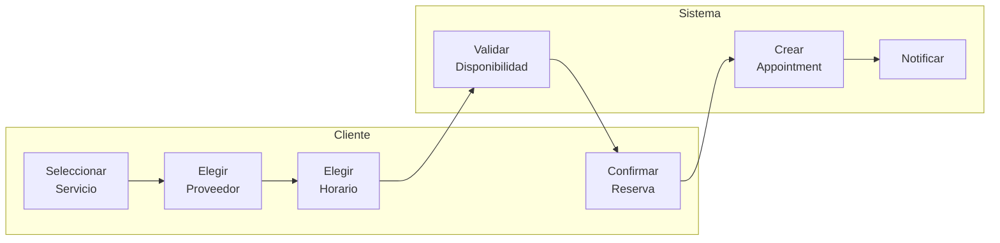
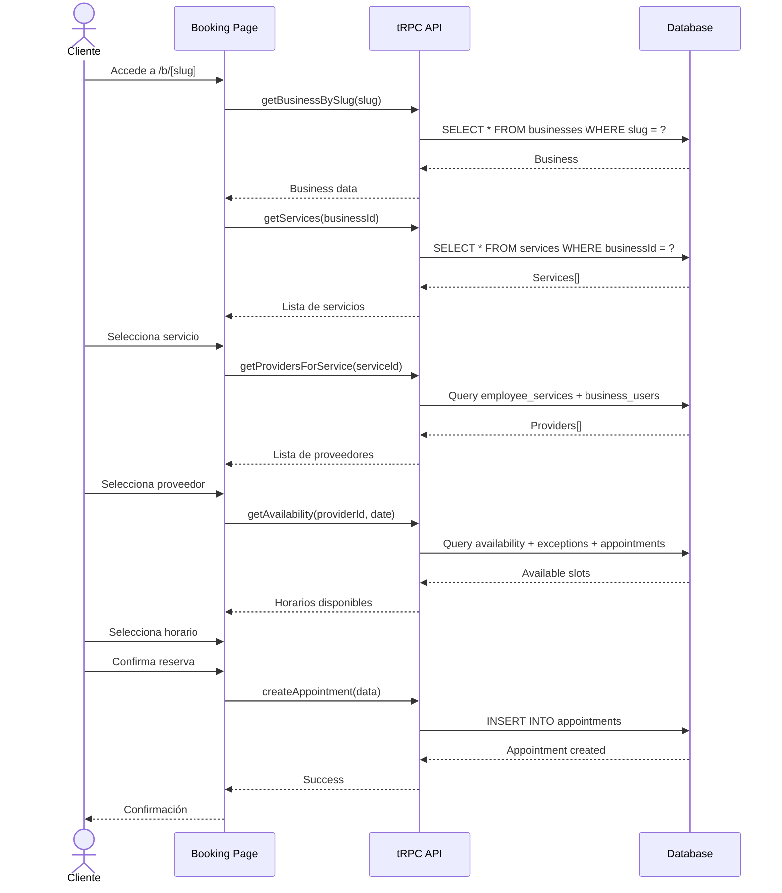
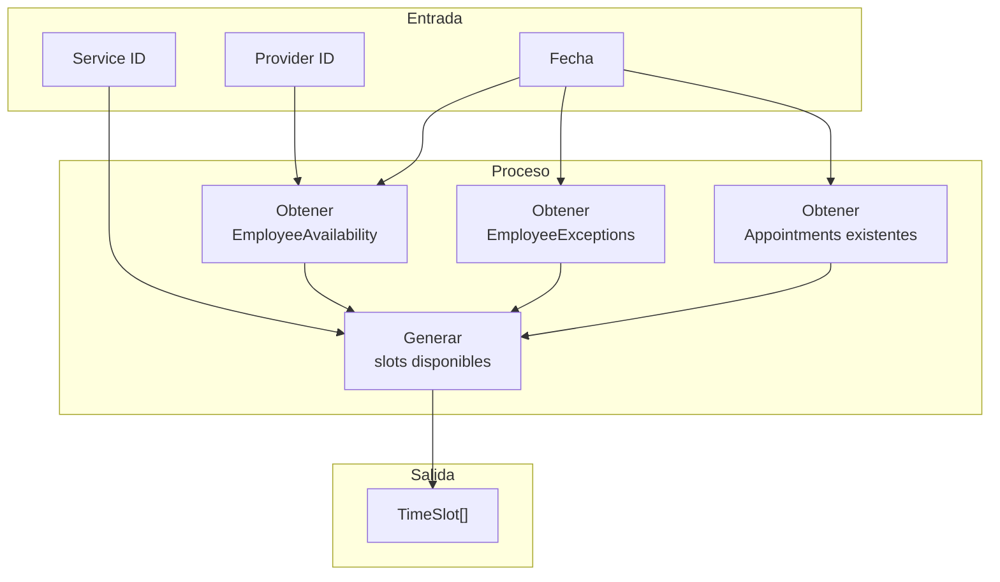
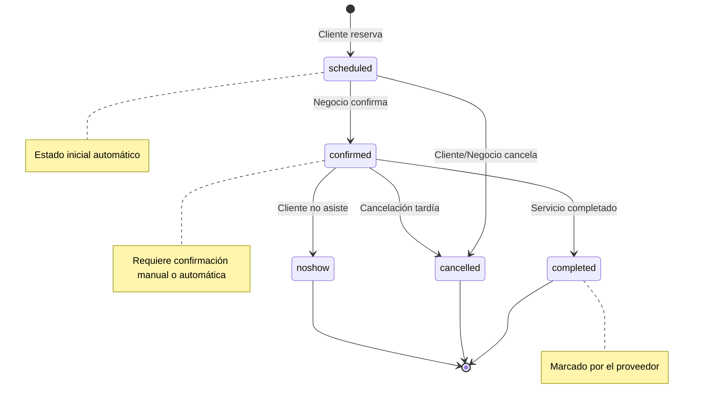
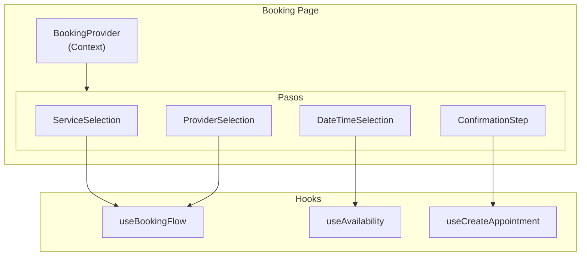
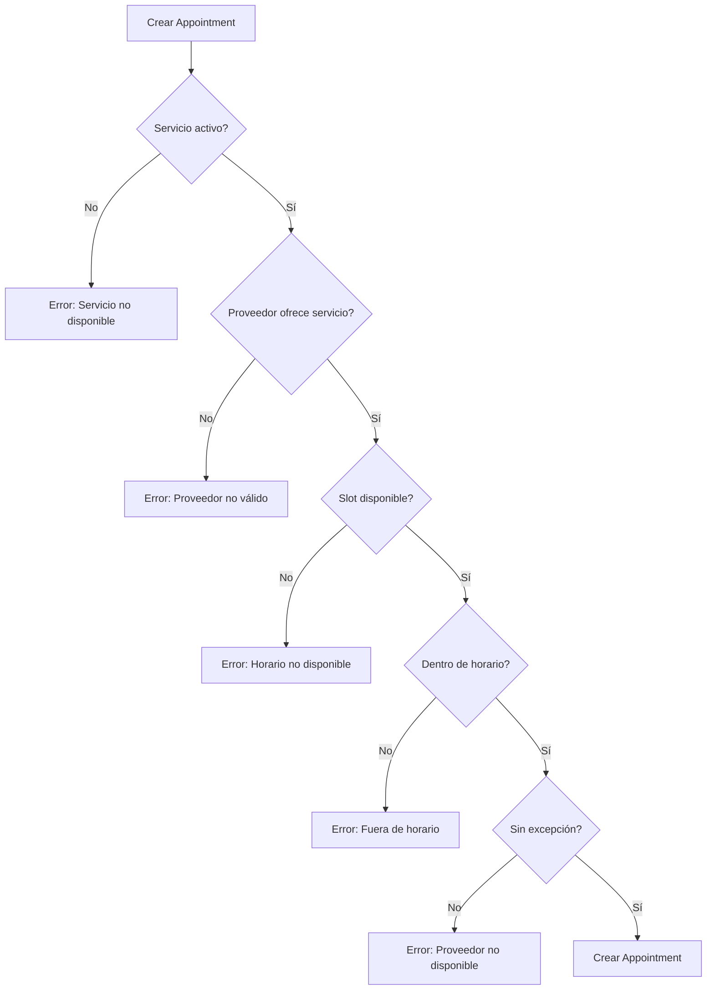
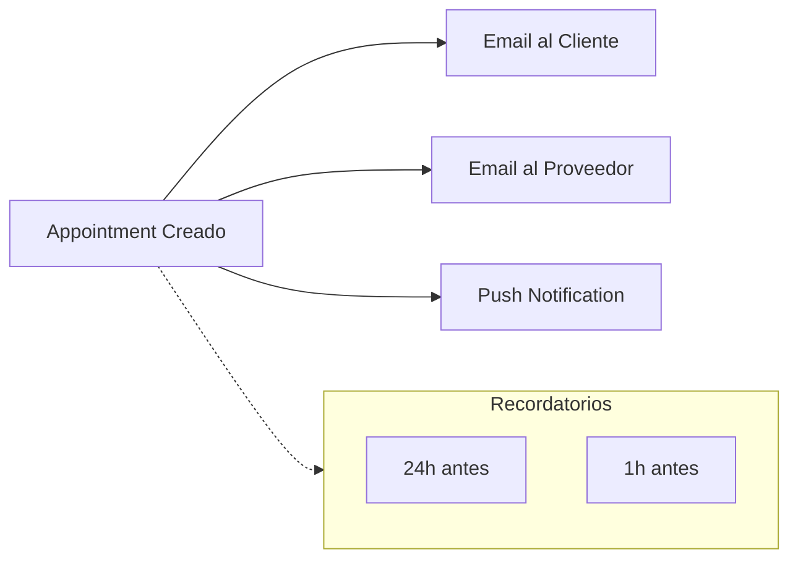

# Flujo de Booking

## Visión General

El flujo de booking permite a los clientes reservar citas con proveedores de servicios.



## Flujo Completo



## Cálculo de Disponibilidad



### Algoritmo de Slots

```typescript
function getAvailableSlots(
  providerId: string,
  date: Date,
  serviceDuration: number
): TimeSlot[] {
  // 1. Obtener disponibilidad del día
  const dayOfWeek = date.getDay();
  const availability = await getEmployeeAvailability(providerId, dayOfWeek);

  // 2. Obtener excepciones del día
  const exceptions = await getEmployeeExceptions(providerId, date);

  // 3. Obtener citas existentes
  const appointments = await getAppointments(providerId, date);

  // 4. Generar slots
  const slots: TimeSlot[] = [];

  for (const period of availability) {
    let current = period.startTime;

    while (current + serviceDuration <= period.endTime) {
      const slot = { start: current, end: current + serviceDuration };

      // Verificar si está bloqueado por excepción
      if (!isBlockedByException(slot, exceptions)) {
        // Verificar si hay conflicto con cita existente
        if (!hasConflict(slot, appointments)) {
          slots.push(slot);
        }
      }

      current += SLOT_INCREMENT; // ej: 15 minutos
    }
  }

  return slots;
}
```

## Estados de Appointment



## Componentes del Booking



### useBookingFlow Hook

```typescript
// client/hooks/use-booking-flow.ts
export function useBookingFlow() {
  const [step, setStep] = useState<BookingStep>('service');
  const [selectedService, setSelectedService] = useState<Service | null>(null);
  const [selectedProvider, setSelectedProvider] = useState<Provider | null>(null);
  const [selectedSlot, setSelectedSlot] = useState<TimeSlot | null>(null);

  const canProceed = useMemo(() => {
    switch (step) {
      case 'service': return !!selectedService;
      case 'provider': return !!selectedProvider;
      case 'datetime': return !!selectedSlot;
      case 'confirmation': return true;
    }
  }, [step, selectedService, selectedProvider, selectedSlot]);

  const nextStep = () => {
    const steps: BookingStep[] = ['service', 'provider', 'datetime', 'confirmation'];
    const currentIndex = steps.indexOf(step);
    if (currentIndex < steps.length - 1) {
      setStep(steps[currentIndex + 1]);
    }
  };

  return {
    step,
    selectedService,
    selectedProvider,
    selectedSlot,
    setSelectedService,
    setSelectedProvider,
    setSelectedSlot,
    canProceed,
    nextStep,
  };
}
```

## Validaciones

### Al Crear Appointment



### Reglas de Negocio

| Regla | Descripción |
|-------|-------------|
| Anticipación mínima | No reservar con menos de X horas de anticipación |
| Anticipación máxima | No reservar con más de X días de anticipación |
| Horario de negocio | Solo dentro del horario del negocio |
| Disponibilidad | Solo cuando el proveedor está disponible |
| Sin conflictos | No superponer con citas existentes |

## Notificaciones


