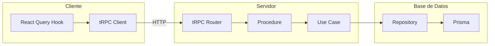
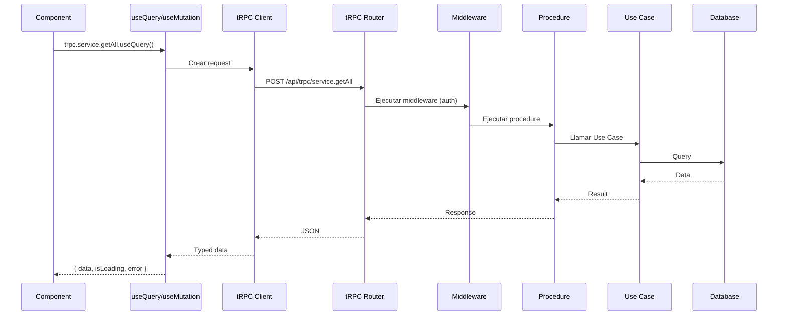
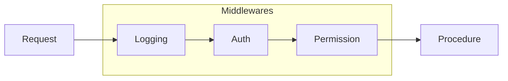
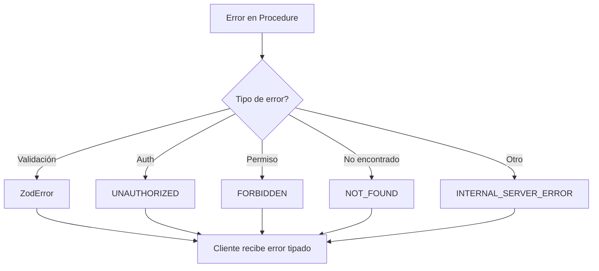
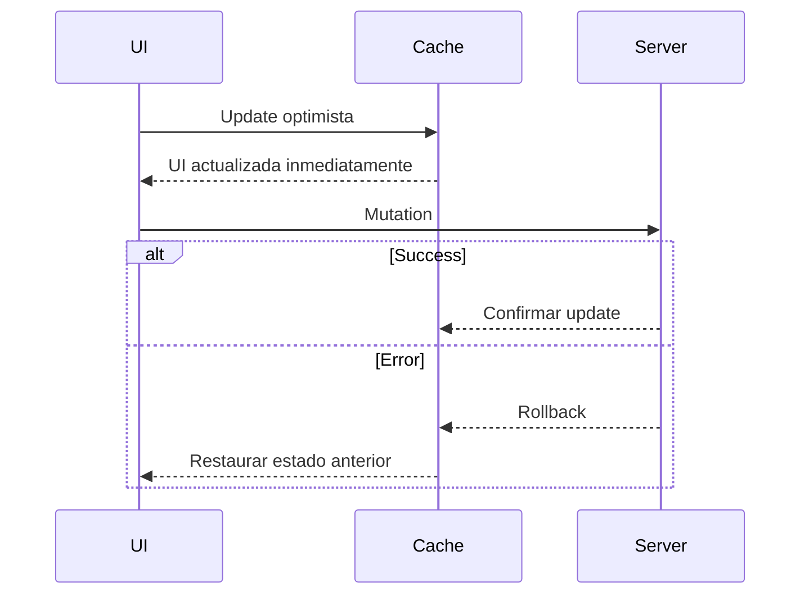

# Flujo CRUD con tRPC

## Visión General

tRPC proporciona una API type-safe entre cliente y servidor.



## Estructura de tRPC

```
src/server/trpc/
├── index.ts              # Export del router
├── trpc.ts               # Contexto y middleware
├── server.ts             # Server-side caller
├── procedures.ts         # Procedimientos reutilizables
├── middlewares/
│   ├── auth.middleware.ts
│   └── logging.middleware.ts
└── routers/
    ├── app.router.ts     # Root router
    ├── user.router.ts
    ├── business.router.ts
    ├── service.router.ts
    └── appointment.router.ts
```

## Flujo de Request



## Ejemplo: CRUD de Servicios

### Router

```typescript
// src/server/trpc/routers/service.router.ts
import { z } from 'zod';
import { router, protectedProcedure } from '../trpc';
import { CreateServiceUseCase } from '@/server/core/application/use-cases/service/CreateService';

export const serviceRouter = router({
  // CREATE
  create: protectedProcedure
    .input(z.object({
      businessId: z.string().uuid(),
      name: z.string().min(1),
      description: z.string().optional(),
      durationMinutes: z.number().min(5),
      price: z.number().min(0),
      currency: z.string().default('USD'),
    }))
    .mutation(async ({ input, ctx }) => {
      const useCase = new CreateServiceUseCase(ctx.serviceRepository);
      return useCase.execute(input);
    }),

  // READ (list)
  getAll: protectedProcedure
    .input(z.object({
      businessId: z.string().uuid(),
    }))
    .query(async ({ input, ctx }) => {
      return ctx.serviceRepository.findByBusinessId(input.businessId);
    }),

  // READ (single)
  getById: protectedProcedure
    .input(z.object({
      id: z.string().uuid(),
    }))
    .query(async ({ input, ctx }) => {
      return ctx.serviceRepository.findById(input.id);
    }),

  // UPDATE
  update: protectedProcedure
    .input(z.object({
      id: z.string().uuid(),
      name: z.string().min(1).optional(),
      description: z.string().optional(),
      durationMinutes: z.number().min(5).optional(),
      price: z.number().min(0).optional(),
      isActive: z.boolean().optional(),
    }))
    .mutation(async ({ input, ctx }) => {
      const { id, ...data } = input;
      return ctx.serviceRepository.update(id, data);
    }),

  // DELETE
  delete: protectedProcedure
    .input(z.object({
      id: z.string().uuid(),
    }))
    .mutation(async ({ input, ctx }) => {
      return ctx.serviceRepository.delete(input.id);
    }),
});
```

### Cliente

```typescript
// client/features/services/hooks/use-services.ts
import { trpc } from '@/client/lib/trpc';

export function useServices(businessId: string) {
  return trpc.service.getAll.useQuery({ businessId });
}

export function useCreateService() {
  const utils = trpc.useUtils();

  return trpc.service.create.useMutation({
    onSuccess: () => {
      // Invalidar cache para refrescar lista
      utils.service.getAll.invalidate();
    },
  });
}

export function useUpdateService() {
  const utils = trpc.useUtils();

  return trpc.service.update.useMutation({
    onSuccess: (data) => {
      // Actualizar cache optimísticamente
      utils.service.getById.setData({ id: data.id }, data);
      utils.service.getAll.invalidate();
    },
  });
}

export function useDeleteService() {
  const utils = trpc.useUtils();

  return trpc.service.delete.useMutation({
    onSuccess: () => {
      utils.service.getAll.invalidate();
    },
  });
}
```

### Componente

```typescript
// client/features/services/components/service-list.tsx
export function ServiceList({ businessId }: { businessId: string }) {
  const { data: services, isLoading } = useServices(businessId);
  const createService = useCreateService();
  const deleteService = useDeleteService();

  if (isLoading) return <Skeleton />;

  return (
    <div>
      {services?.map((service) => (
        <ServiceCard
          key={service.id}
          service={service}
          onDelete={() => deleteService.mutate({ id: service.id })}
        />
      ))}
    </div>
  );
}
```

## Middleware



### Auth Middleware

```typescript
// src/server/trpc/trpc.ts
const isAuthed = t.middleware(async ({ ctx, next }) => {
  if (!ctx.session?.user) {
    throw new TRPCError({ code: 'UNAUTHORIZED' });
  }
  return next({
    ctx: {
      ...ctx,
      user: ctx.session.user,
    },
  });
});

export const protectedProcedure = t.procedure.use(isAuthed);
```

## Manejo de Errores



```typescript
// Manejo en el cliente
const createService = useCreateService();

const handleSubmit = async (data: ServiceForm) => {
  try {
    await createService.mutateAsync(data);
    toast.success('Servicio creado');
  } catch (error) {
    if (error instanceof TRPCClientError) {
      if (error.data?.code === 'UNAUTHORIZED') {
        router.push('/login');
      } else if (error.data?.code === 'FORBIDDEN') {
        toast.error('No tienes permiso para esta acción');
      } else {
        toast.error(error.message);
      }
    }
  }
};
```

## Optimistic Updates



```typescript
const updateService = trpc.service.update.useMutation({
  onMutate: async (newData) => {
    // Cancelar queries en progreso
    await utils.service.getById.cancel({ id: newData.id });

    // Guardar estado anterior
    const previousData = utils.service.getById.getData({ id: newData.id });

    // Update optimista
    utils.service.getById.setData({ id: newData.id }, (old) => ({
      ...old!,
      ...newData,
    }));

    return { previousData };
  },
  onError: (err, newData, context) => {
    // Rollback en caso de error
    utils.service.getById.setData(
      { id: newData.id },
      context?.previousData
    );
  },
  onSettled: () => {
    // Refrescar datos del servidor
    utils.service.getAll.invalidate();
  },
});
```
