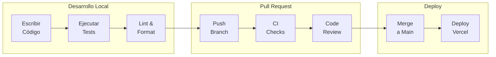

# Desarrollo

## Comandos Principales

```bash
# Desarrollo
pnpm dev              # Iniciar web-app en puerto 3001
pnpm dev:all          # Iniciar todos los workspaces

# Base de datos
pnpm db:start         # Iniciar PostgreSQL (Docker)
pnpm db:stop          # Detener PostgreSQL
pnpm db:migrate       # Ejecutar migraciones
pnpm db:studio        # Abrir Prisma Studio (puerto 5555)
pnpm db:generate      # Regenerar cliente Prisma

# Calidad de código
pnpm lint             # Ejecutar ESLint
pnpm lint:fix         # Auto-fix de ESLint
pnpm format           # Formatear con Prettier
pnpm typecheck        # Verificar tipos TypeScript
pnpm test             # Ejecutar tests con Jest
```

## Estructura de Puertos

| Servicio | Puerto |
|----------|--------|
| Web App | 3001 |
| Prisma Studio | 5555 |
| PostgreSQL | 5432 |

## Flujo de Desarrollo



## Convenciones de Código

### Nombres de Archivos

| Tipo | Patrón | Ejemplo |
|------|--------|---------|
| Componentes | PascalCase | `UserProfile.tsx` |
| Server Actions | kebab-case + `.action.ts` | `get-user.action.ts` |
| Hooks | camelCase + `use` prefix | `useAuth.ts` |
| Utilidades | kebab-case | `format-date.ts` |
| Tipos | PascalCase + `.types.ts` | `auth.types.ts` |

### Commits

Seguimos [Conventional Commits](https://www.conventionalcommits.org/):

```
feat: agregar nueva funcionalidad
fix: corregir bug
docs: actualizar documentación
refactor: reestructurar código
test: agregar tests
chore: tareas de mantenimiento
```

## Herramientas Recomendadas

### VS Code Extensions

- ESLint
- Prettier
- Tailwind CSS IntelliSense
- Prisma
- TypeScript + JavaScript

### Configuración de VS Code

```json
{
  "editor.formatOnSave": true,
  "editor.defaultFormatter": "esbenp.prettier-vscode",
  "editor.codeActionsOnSave": {
    "source.fixAll.eslint": true
  }
}
```
