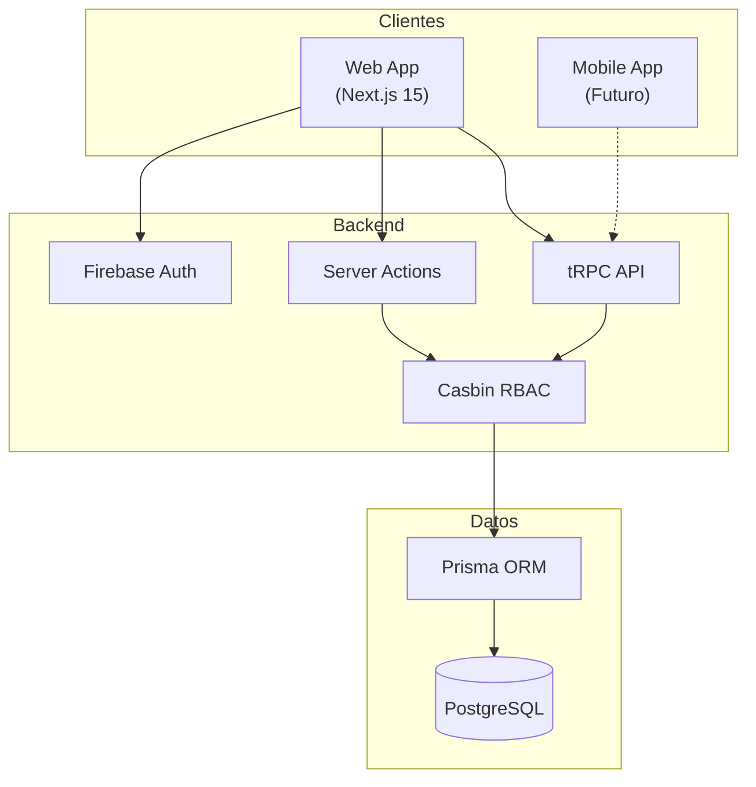
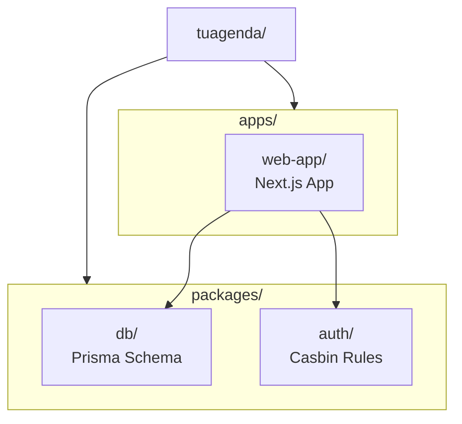

# TuAgenda

Sistema de gestión de citas y reservas multi-tenant.

## Visión General



## Stack Tecnológico

| Capa | Tecnología |
|------|------------|
| **Frontend** | Next.js 15, React 19, Tailwind CSS v4 |
| **UI Components** | Radix UI, Lucide Icons |
| **Forms** | React Hook Form + Zod |
| **Data Fetching** | TanStack Query + tRPC |
| **Backend** | Next.js Server Actions, tRPC |
| **Auth** | Firebase Authentication |
| **Authorization** | Casbin (RBAC/ABAC) |
| **Database** | PostgreSQL + Prisma ORM |
| **Calendar** | FullCalendar |

## Estructura del Monorepo



## Quick Start

```bash
# Clonar el repositorio
git clone https://github.com/tuagenda/tuagenda.git

# Instalar dependencias
pnpm install

# Iniciar base de datos
pnpm db:start
pnpm db:migrate

# Iniciar desarrollo
pnpm dev
```

## Navegación

- [**Getting Started**](/getting-started/installation) - Instalación y configuración
- [**Arquitectura**](/architecture/overview) - Diseño del sistema
- [**Base de Datos**](/database/erd) - Modelos y relaciones
- [**Flujos**](/flows/authentication) - Procesos principales
