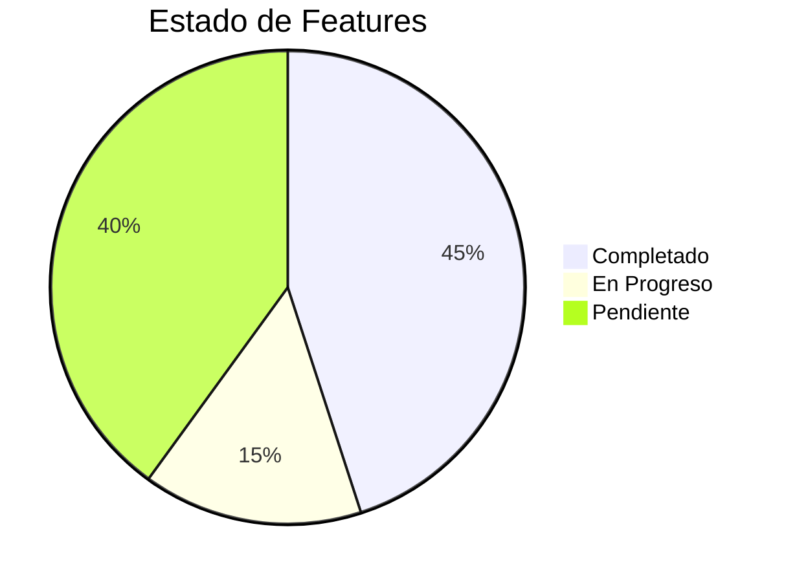
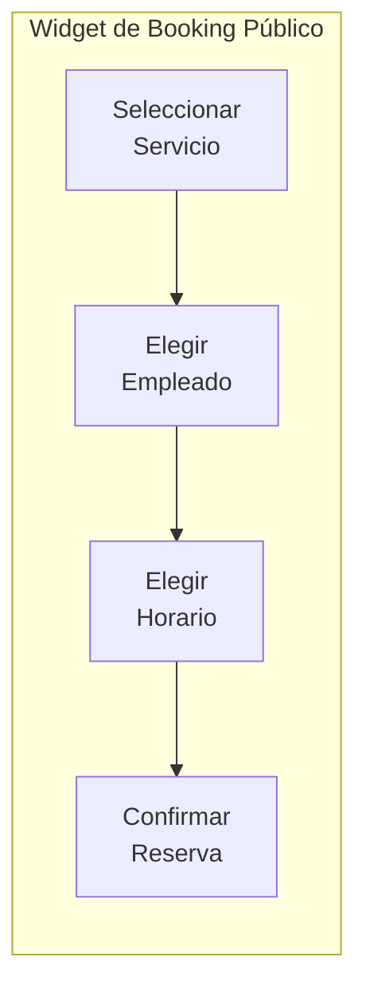
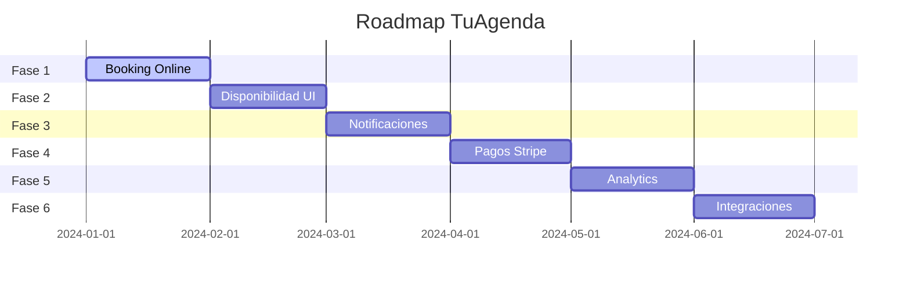

# Roadmap

## Estado Actual del Proyecto

## Features Implementados

| Feature | Estado | Descripción |
|---------|--------|-------------|
| Dashboard | ✅ Completo | Estadísticas en tiempo real, citas recientes, métricas |
| Gestión de Empleados | ✅ Completo | CRUD, roles, permisos, disponibilidad |
| Calendario | ✅ Completo | Vista interactiva con FullCalendar |
| Gestión de Clientes | ✅ Completo | Lista, historial, métricas de retención |
| Catálogo de Servicios | ✅ Completo | CRUD, categorías, precios, duración |
| Ubicaciones | ✅ Completo | Multi-sucursal |
| Configuración | ✅ Completo | Perfil, preferencias, idioma, zona horaria |
| Autenticación | ✅ Completo | Firebase Auth, login/signup |
| Autorización | ✅ Completo | Casbin RBAC/ABAC |
| Arquitectura Hexagonal | ✅ Completo | Use Cases, Repositories, Mappers |
| tRPC API | ✅ Completo | Type-safe API layer |

## Features Pendientes

### Fase 1: Booking Online (Prioridad Alta)

| Componente | Estado | Descripción |
|------------|--------|-------------|
| Página pública de booking | 🚧 En progreso | `/b/[slug]` - Página por negocio |
| Selector de servicio | 🚧 En progreso | Lista de servicios disponibles |
| Selector de empleado | 🚧 En progreso | Filtrado por servicio |
| Selector de fecha/hora | 🚧 En progreso | Calendario con slots disponibles |
| Cálculo de disponibilidad | ⏳ Pendiente | Algoritmo de slots libres |
| Confirmación de reserva | ⏳ Pendiente | Resumen y creación de cita |
| Email de confirmación | ⏳ Pendiente | Notificación al cliente |

### Fase 2: Gestión de Disponibilidad

| Componente | Estado | Descripción |
|------------|--------|-------------|
| Horarios por empleado | ✅ Completo | `EmployeeAvailability` en DB |
| Excepciones (vacaciones) | ✅ Completo | `EmployeeException` en DB |
| Editor visual de horarios | ⏳ Pendiente | UI para configurar horarios |
| Gestor de días libres | ⏳ Pendiente | UI para vacaciones |
| Bloqueos de tiempo | ⏳ Pendiente | UI para bloquear slots |

### Fase 3: Notificaciones y Recordatorios

| Componente | Estado | Descripción |
|------------|--------|-------------|
| Centro de notificaciones | ✅ Completo | UI básica implementada |
| Email de confirmación | ⏳ Pendiente | Al crear cita |
| Recordatorio 24h antes | ⏳ Pendiente | Cron job + email |
| Recordatorio 1h antes | ⏳ Pendiente | Cron job + email |
| SMS (opcional) | ⏳ Pendiente | Integración Twilio |
| Push notifications | ⏳ Pendiente | Web push |

### Fase 4: Pagos Online

| Componente | Estado | Descripción |
|------------|--------|-------------|
| Integración Stripe | ⏳ Pendiente | Pasarela de pagos |
| Pago al reservar | ⏳ Pendiente | Cobro anticipado |
| Depósitos | ⏳ Pendiente | Pago parcial |
| Reembolsos | ⏳ Pendiente | Devoluciones |
| Historial de transacciones | ⏳ Pendiente | Reportes |

### Fase 5: Analytics y Reportes

| Componente | Estado | Descripción |
|------------|--------|-------------|
| Gráficos de ingresos | ⏳ Pendiente | Semanal/mensual/anual |
| Tasa de ocupación | ⏳ Pendiente | Por empleado |
| Servicios populares | ⏳ Pendiente | Ranking |
| Horas pico | ⏳ Pendiente | Análisis de demanda |
| Exportar reportes | ⏳ Pendiente | PDF/Excel |

### Fase 6: Integraciones

| Componente | Estado | Descripción |
|------------|--------|-------------|
| Google Calendar sync | ⏳ Pendiente | Sincronización bidireccional |
| Apple Calendar | ⏳ Pendiente | iCal export |
| Outlook | ⏳ Pendiente | Office 365 integration |
| WhatsApp Business | ⏳ Pendiente | Notificaciones |

## Mejoras de UX Pendientes

| Mejora | Prioridad | Estado |
|--------|-----------|--------|
| Loading states (skeletons) | Alta | ⏳ Pendiente |
| Empty states | Alta | ⏳ Pendiente |
| Error handling (toasts) | Alta | 🚧 Parcial |
| Confirmaciones de eliminación | Alta | ⏳ Pendiente |
| Filtros avanzados | Media | ⏳ Pendiente |
| Búsqueda global | Media | ⏳ Pendiente |
| Drag & drop en calendario | Baja | ⏳ Pendiente |
| Temas personalizados | Baja | ⏳ Pendiente |
| Onboarding tutorial | Baja | ⏳ Pendiente |

## Features Futuros (Nice to Have)

### Para el Negocio

| Feature | Descripción |
|---------|-------------|
| QR Check-in | Clientes escanean QR al llegar |
| Lista de espera | Cuando no hay slots |
| Promociones/Cupones | Ofertas especiales |
| Membresías | Planes con descuentos |
| Multi-idioma extendido | Más idiomas |
| Backup automático | Respaldo de datos |

### Para Clientes

| Feature | Descripción |
|---------|-------------|
| App móvil nativa | iOS/Android |
| Reviews y ratings | Calificar servicios |
| Favoritos | Guardar empleados |
| Historial de servicios | Ver citas pasadas |
| Referidos | Compartir con amigos |

### Para Empleados

| Feature | Descripción |
|---------|-------------|
| App móvil staff | Ver agenda personal |
| Comisiones | Cálculo automático |
| Portal de empleado | Estadísticas personales |
| Sistema de propinas | Tips digitales |

## Roadmap Visual

## Leyenda

| Símbolo | Significado |
|---------|-------------|
| ✅ | Completado |
| 🚧 | En progreso |
| ⏳ | Pendiente |
